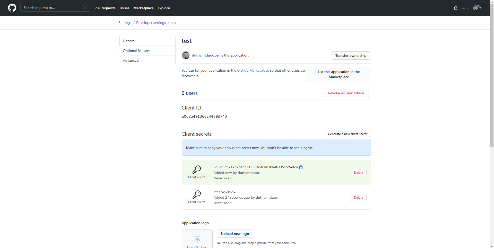

# Github Search

## Register new Oauth Github

- Vào trang [https://github.com/settings/applications/new](https://github.com/settings/applications/new) đăng ký một OAuth application

- Generate một client secret

- Fetch Profile:
  `https://api.github.com/users/${username}?client_id=${this.client_id}&client_secret=${this.client_secret}`

- Fetch Repo:
  `https://api.github.com/users/${username}/repos?per_page=${this.repos_count}&sort=${this.repos_sort}&client_id=${this.client_id}&client_secret=${this.client_secret}`
