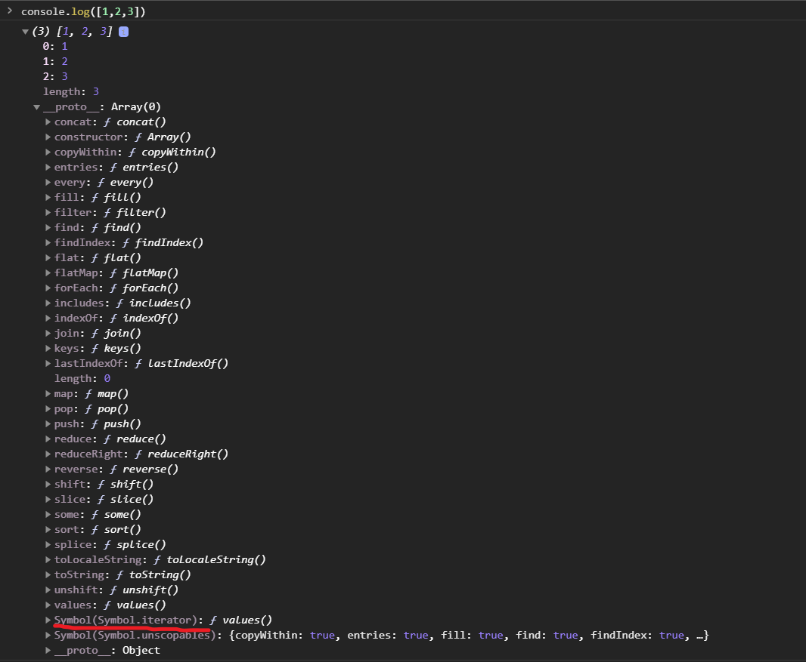

# Iterators và Generators

[Bài gốc: Bạn đã biết về Iterator, Iterable và Generator trong Javascript chưa?](https://xdevclass.com/ban-da-biet-ve-iterator-iterable-va-generators-trong-javascript-chua/)

Code Javascript lâu năm chắc chắn bạn chưa biết điều này (mình đùa theo trend tiktok 1 tí, bạn nào biết rồi thì xem tiếp chứ đừng bỏ qua):mrgreen: .

Đó là Iterator, Iterable và Generator. Nó không hề mới, nó đã có từ khá lâu rồi nhưng đôi khi chúng ta ít dùng hay chưa gặp nên chưa để ý nó.

Không sao ^^! Hôm nay mình sẽ cùng các bạn đi tìm hiểu rõ chúng là gì và các trường hợp nào dùng chúng.

## Iterator là gì?

Trong Javascript, một **iterator** là một object mà nó định nghĩa một trình tự và giá trị có thể trả về tiếp theo trước khi kết thúc. Nghe hơi khó hiểu nhở 😯 .

Xem ví dụ là hiểu ngay.

```js
function makeRangeIterator(start = 0, end = Infinity, step = 1) {
  let nextIndex = start
  let iterationCount = 0
  const rangeIterator = {
    next: function () {
      let result
      if (nextIndex <= end) {
        result = { value: nextIndex, done: false }
        nextIndex += step
        iterationCount++
        return result
      }
      return { value: iterationCount, done: true }
    }
  }
  return rangeIterator
}
let it = makeRangeIterator(1, 6, 2)
console.log(it.next()) // {value: 1, done: false}
console.log(it.next()) // {value: 3, done: false}
console.log(it.next()) // {value: 5, done: false}
console.log(it.next()) // {value: 3, done: true}
```

function tạo iterator `makeRangeIterator` nhận vào 3 tham số đó là: dãy số nguyên bắt đầu từ `start` đến `end` với bước nhảy là `step`.

Giá trị trả về cuối cùng là kích thước của dãy giá trị mà nó đã tạo, được ghi nhận trong biến `iterationCount`.

Nhìn vào ví dụ trên bạn thấy phương thức `next()` không?

Phương thức theo format như vậy gọi là **giao thức iterator**, nghĩa là trả về một object với thuộc tính.

- `value`: giá trị kế tiếp của chuỗi giá trị
- `done`: boolean, nếu là true thì giá trị cuối cùng của chuỗi giá trị đã được sử dụng

Việc duyệt qua iterator chỉ thực hiện 1 lần duy nhất.

Đơn giản vậy thôi, tìm hiểu tiếp **iterable** nhé.

## Iterable là gì?

**Iterable** nghĩa là khả duyệt, tức là có thể lặp qua các phần tử bằng `for...of`. Một đối tượng muốn được lặp bằng `for...of` thì phải có phương thức **@@iterator** (tên phương thức nó là như vậy, mục đích chủ yếu là để quy định ràng buộc các kiểu return trong phương thức).

Phương thức **@@iterator** được cài đặt thông qua thuộc tính tên là `Symbol.iterator` (kiểu symbol).

Ví dụ ta có object `range` đại diện cho 1 khoản giá trị

```js
let range = {
  from: 1,
  to: 5
}
// Chúng ta muốn for...of hoạt động:
// for(let num of range) ... num=1,2,3,4,5
```

Để làm object `range` trở thành một iterable object (và để cho `for...of` hoạt động) chúng ta cần thêm một phương thức được đặt tên là `Symbol.iterator`.

1. Khi `for...of` bắt đầu, nó gọi phương thức 1 lần (hoặc lỗi nếu không tìm thấy phương thức). Phương thức này phải return về một iterator – một object với phương thức `next`.

2. Sau đó, `for...of` chỉ làm việc với object được trả về của `next()`.

3. Khi `for...of` muốn giá trị tiếp theo, nó gọi `next()` trên object đó.

4. Kết quả của `next()` khi return phải là định dạng `{done: Boolean, value: any}`, khi `done==true` (giá trị của `done` không nhất thiết phải true/false, bạn cũng có thể lưu là 0/1, nhưng mình khuyên nên dùng true/false cho tường mình) nghĩa là quá trình lặp kết thúc, nếu không thì `value` là giá trị kế tiếp.

Đây là đoạn code được sửa lại:

```js
let range = {
  from: 1,
  to: 5
}
// 1. for...of yêu cầu phương thức này
range[Symbol.iterator] = function () {
  // ...nó trả về một iterator object:
  // 2. Tiếp sau đó, for..of chỉ làm việc với iterator này,
  return {
    current: this.from,
    last: this.to,
    // 3. next() được gọi trên mỗi vòng lặp for..of
    next() {
      // 4. Phải return về định dạng {done:.., value :...}
      if (this.current <= this.last) {
        return { done: false, value: this.current++ }
      } else {
        return { done: true }
      }
    }
  }
}
// Bây giờ đã hoạt động!
for (let num of range) {
  console.log(num) // 1, then 2, 3, 4, 5
}
```

Có thể bây giờ bạn sẽ thắc mắc. **String**, **Array** cũng có thể dùng `for...of` cơ mà, có thấy nó cài phương thức gì đâu?

Thật ra thì **String**, **Array**, **Map** nó có sẵn phương thức **@@iterator** mặc định trong **prototype** của nó. Trong khi một số kiểu khác thì không có, ví dụ như **Object**.



Đến đây bạn sẽ tự hỏi, vậy iterator object có phải là iterable object hay không?

Câu trả lời là **không**! Đơn giản vì bạn không thể `for...of` iterator được.

## Generator là gì?

**Generator** là một object return bởi một generator function, và nó cũng là một **iterable**, cũng như là một **iterator**.

**Generator** chỉ được tạo từ generator function.

**Cú pháp**:

```js
function* makeGenerator(i) {
  yield i + 1
  console.log('Dòng này sẽ được in khi next() lần 2')
  yield i + 2
  console.log('Dòng này sẽ được in khi next() lần 3')
  yield i + 3
  return i + 4
}
const generator = makeGenerator(0)
generator.next() // {value: 1, done: false}
generator.next() // {value: 2, done: false}
generator.next() // {value: 3, done: false}
generator.next() // {value: 4, done: true}
```

**Đặc điểm**

- Hàm có thể dừng lại khi `yield` hoặc `return`, và tiếp tục chạy khi bạn `next()`
- Không `return` tức là return undefined

**Phương thức của generator**

- `next()`: tiếp tục cho hàm chạy cho đến khi gặp `yield` hoặc `return`. return object `{value: any, done: true/false}`

- `return(value)`: kết thúc generator và return object `{value: any, done: true}`

- `throw()`: quăng 1 lỗi vào trong generator function (đồng thời kết thúc generator, trừ khi được bắt lại trong generator đó). return object `{value: any, done: true/false}`

Ví dụ về method `return()`

```js
function* gen() {
  yield 1
  yield 2
  yield 3
}
const g = gen()
g.next() // { value: 1, done: false }
g.return('foo') // { value: "foo", done: true }
g.next() // { value: undefined, done: true }
```

Ví dụ về method `throw()`

```js
function* gen() {
  while (true) {
    try {
      yield 42
    } catch (e) {
      console.log(e.message)
    }
  }
}
const g = gen()
g.next()
// { value: 42, done: false }
g.throw(new Error('Something went wrong'))
// "Something went wrong"
// { value: 42, done: false }
```

## Các trường hợp dùng generator

### Generator áp dụng trong Redux-Saga

Nếu bạn dùng Redux-Saga với React thì chắc hẳn không lạ gì với generator và yield

```js
import { put, takeEvery, call } from 'redux-saga/effects'
const url = '/api/data/get'
export function* requestFetch() {
  yield put({ type: 'FETCH_DATA' })
  try {
    const dataJSON = yield call(
      fetch(url, { 'content-type': 'application/json' })
    )
    const data = yield call(dataJSON.json())
    yield put({ type: 'FETCH_DATA_SUCCESS', data })
  } catch (error) {
    yield put({ type: 'FETCH_DATA_FAIL', error })
  }
}
```

### Các trường hợp cần ghi nhớ

Ví dụ chúng ta xem video, khi pause giữa chừng 1 video và nhấn play lại. Chúng ta muốn là máy tính sẽ tính toán và load tiếp tục từ đoạn pause trở đi chứ không phải là bắt đầu lại từ đầu.

Điển hình là bài toán viết một hàm để in ra số fibonacci thứ 1, 2, 3, 4.

Nếu code thông thường thì ta sẽ code như thế này

```js
const fibonacci = (n) => {
  if (n === 1 || n === 2) {
    return 1
  }
  return fibonacci(n - 1) + fibonacci(n - 2)
}
console.log(fibonacci(1)) // 1
console.log(fibonacci(2)) // 1
console.log(fibonacci(3)) // 2
console.log(fibonacci(4)) // 3
```

Nếu viết theo cách này thì khi tính số fibinacci thứ 3 thì ta phải tính lại số fibonacci thứ 2 (mặc dầu trước đó ta đã tính rồi), như vậy khá tốn hiệu năng máy tính.

Sẽ có nhiều hướng giải quyết cho bài toán này, dùng generator function là một ví dụ.

```js
function* fibonacci() {
  let prev = 0
  let curr = 1
  while (true) {
    yield curr
    const next = prev + curr
    prev = curr
    curr = next
  }
}
const fib = fibonacci()
console.log(fib.next().value) // 1
console.log(fib.next().value) // 1
console.log(fib.next().value) // 2
console.log(fib.next().value) // 3
```

Hoặc đơn cử bài toán tạo ra các ID riêng biệt

```js
function* makeId() {
  let i = 0
  while (true) yield i++
}
const ids = makeId()
console.log(ids.next().value) // 0
console.log(ids.next().value) // 1
console.log(ids.next().value) // 2
```

## Tóm lại

Sau bài hôm nay, mình hy vọng đã giải đáp được một phần thắc mắc của mọi người về 3 khái niêm **Iterator**, **Iterable** và **Generator**. Chúng không quá khó để hiểu, vì thế hãy đọc cẩn thận nha :mrgreen:

Hẹn gặp mọi người ở bài tiếp theo.

## Tham khảo

[https://developer.mozilla.org/vi/docs/Web/JavaScript/Guide/Iterators_and_Generators](https://developer.mozilla.org/vi/docs/Web/JavaScript/Guide/Iterators_and_Generators)

[https://javascript.info/iterable](https://javascript.info/iterable)
