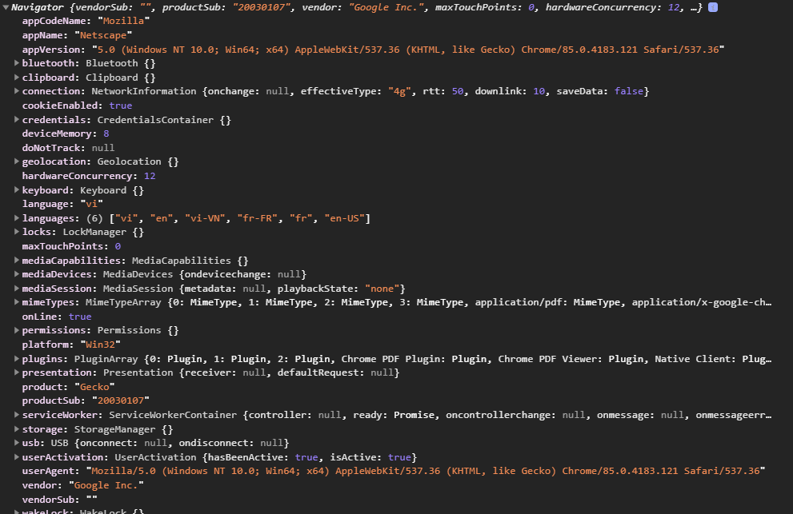

# Window Object

**Window object** được hỗ trợ trên mọi trình duyệt. Nó đại diện cho cửa sổ trình duyệt.

Tất cả [global Javascript object](https://javascript.info/global-object), function, biến (phải khai báo bằng `var` nha, không phải `let/const`) đều tự động trở thành thuộc tính (hoặc phương thức) của `window` object.

Ngay cả `document` object (của HTML DOM) cũng là một thuộc tính của `window` object

```javascript
alert('Hello')
// tương đương
window.alert('Hello')
```

```javascript
var gVar = 5
alert(window.gVar)
```

```javascript
window.document.getElementById('header')
// tương đương
document.getElementById('header')
```

**Một số thuộc tính và phương thức của window object**

- `window.innerHeight`: Chiều cao bên trong của cửa sổ trình duyệt (pixel)
- `window.innerWidth`: Chiều rộng bên trong của cửa sổ trình duyệt (pixel)
- `window.open()`: mở một cửa sổ
- `window.close()`: đóng cửa sổ hiện tại
- `window.resizeTo()`: resize cửa sổ hiện tại

## Window location

`window.location` (location) object có thể được sử dụng để lấy thông tin địa chỉ url hiện tại và chuyển hướng trình duyệt sang 1 trang mới.

- `window.location.href` return về URL trang hiện tại
- `window.location.hostname` return tên domain
- `window.location.pathname` return pathmane của trang hiện tại
- `window.location.protocol` return giao thức trang web (http: hoặc https:)
- `window.location.assign()` chuyển hướng sang một trang mới

Ví dụ:

```javascript
console.log(location.href) // https://www.xdevclass.com/phan-5-thao-tac-html-css-dom-va-browser-bom-voi-javascript
console.log(location.hostname) // www.xdevclass.com
console.log(location.pathname) // /phan-5-thao-tac-html-css-dom-va-browser-bom-voi-javascript
console.log(location.protocol) // https:
location.assign('https://www.google.com/') // Chuyển đến trang google
location.href = 'https://www.google.com/' // Tương đương location.assign()
```

## Window Navigator

`window.navigator` có thể cho ta biết thông tin trình duyệt của người dùng

Ví dụ

- `navigator.language`: return ngôn ngữ trình duyệt
- `navigator.userAgent`: return **user-agent header** được gửi bởi trình duyệt đến server

Nói chung thì **navigator** còn cực nhiều thuộc tính và phương thức, liệt kê không hết luôn, mọi người có thể thao khảo hình dưới



## Window History

`window.history` object chứa lịch sử của trình duyệt

**Một số phương thức phổ biến**:

- `history.back()` dùng để trở về trang trước
- `history.forward()` dùng để đi đến trang tiếp theo
