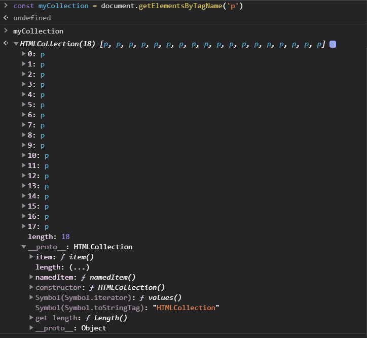
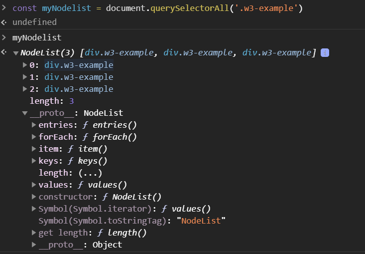

# Select nhiều element

Khi select nhiều element bạn sẽ gặp 2 trường hợp là câu lệnh return về HTML Colection hoặc Node List

## HTML Collection

Phương thức `getElementsByTagName`, `getElementsByClassName` sẽ return về một **HTML Collection** object

**HTML Collection** là một object (khá giống array nhưng không phải là array) chứa tập hợp các element. Object này đánh dấu các element thông qua index bắt đầu từ **0**.



Ví dụ DOM element trong HTML Collection

```javascript
const myCollection = document.getElementsByTagName('p')
for (let i = 0; i < myCollection.length; i++) {
  myCollection[i].style.color = 'red'
}
```

## Node List

Phương thức `querySelectorAll()` sẽ return về một **Node List** object

Trong khi **HTML Collection** chỉ chứa danh sách các thẻ HTML thì **NodeList** có thể chứa các thẻ html, text, hoặc comment. **Node List** object sẽ có những phương thức mà **HTML Collection** object không có.


