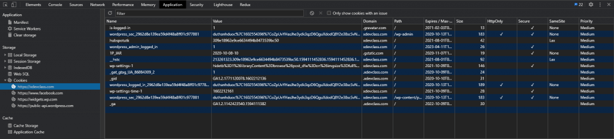
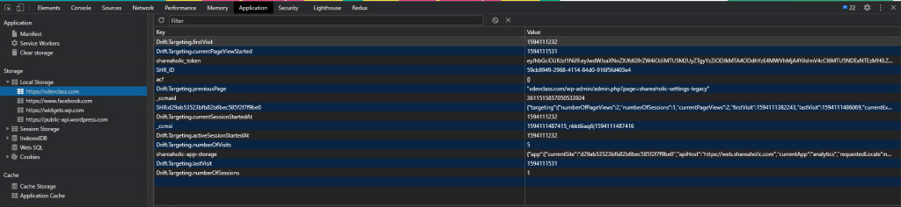

# Local Storage và Cookie

## Cookie

Cookie cho phép bạn lưu trữ thông tin người dùng website vào máy tính của bạn.

**Tạo một cookie với Javascript**

Javascript có thể tạo, đọc, xóa các cookie với thuộc tính `document.cookie`

Một cookie có thể được tạo như thế này

```javascript
document.cookie = 'username=John Doe'
```

**Bạn cũng có thể thêm thời gian hết hạn (định dạng UTC). Vì mặc định cookie sẽ bị xóa khi trình duyệt đóng.**

```javascript
document.cookie = 'username=John Doe; expires=Thu, 18 Dec 2013 12:00:00 UTC'
```

**Với tham số `path`, bạn có thể nói cho trình duyệt path mà cookie thuộc về. Mặc định thì cookie thuộc về trang web hiện tại**

```javascript
document.cookie =
  'username=John Doe; expires=Thu, 18 Dec 2013 12:00:00 UTC; path=/'
```

**Đọc một cookie với javascript**

```javascript
var x = document.cookie
```

`document.cookie` sẽ return tất cả cookie trong 1 chuỗi kiểu như: `cookie1=value; cookie2=value; cookie3=value;`

**Thay đổi một cookie thì tương tự như cách ta tạo ra nó, giá trị cũ sẽ bị thay thế**

```javascript
document.cookie =
  'username=John Smith; expires=Thu, 18 Dec 2013 12:00:00 UTC; path=/'
```

**Xóa một cookie**

Xóa cookie bằng Javascript rất đơn giản, chỉ cần set thời gian hết hạn về giá trị như dưới đây

```javascript
document.cookie = 'username=; expires=Thu, 01 Jan 1970 00:00:00 UTC; path=/;'
```

**Lưu ý:**

- Nếu bạn set một cookie mới, tất cả các cookie cũ sẽ không bị thay thế. Cookie mới sẽ được thêm vào `document.cookie`.
- Cookie được lưu theo trang web. Ví dụ bạn ở trang [xdevclass.com](xdevclass.com), bạn không thể truy cập đến cookie của trang [google.com](google.com) được lưu trên máy bạn.
- Nếu chỉ dùng các phương thức và thuộc tính có sẵn thì xử lý cookie không tiện lắm. Thường thì mọi người sẽ viết một function để tiện cho việc thao tác hoặc đơn giản là dùng thư viện [js-cookie](https://github.com/js-cookie/js-cookie)



## Local Storage

Tương tự Cookie, local storage là một Web API giúp bạn lưu data website vào máy tính của bạn. Local storage tồn tại mãi mãi cho đến khi nó bị xóa.

Cú pháp siêu đơn giản, dễ dùng hơn Cookie nhiều

```javascript
// thêm item
localStorage.setItem('name', 'John Doe')
// đọc item
localStorage.getItem('name') // 'John Doe'
// xóa item
localStorage.removeItem('name')
// xóa hết local storage
localStorage.clear()
```


