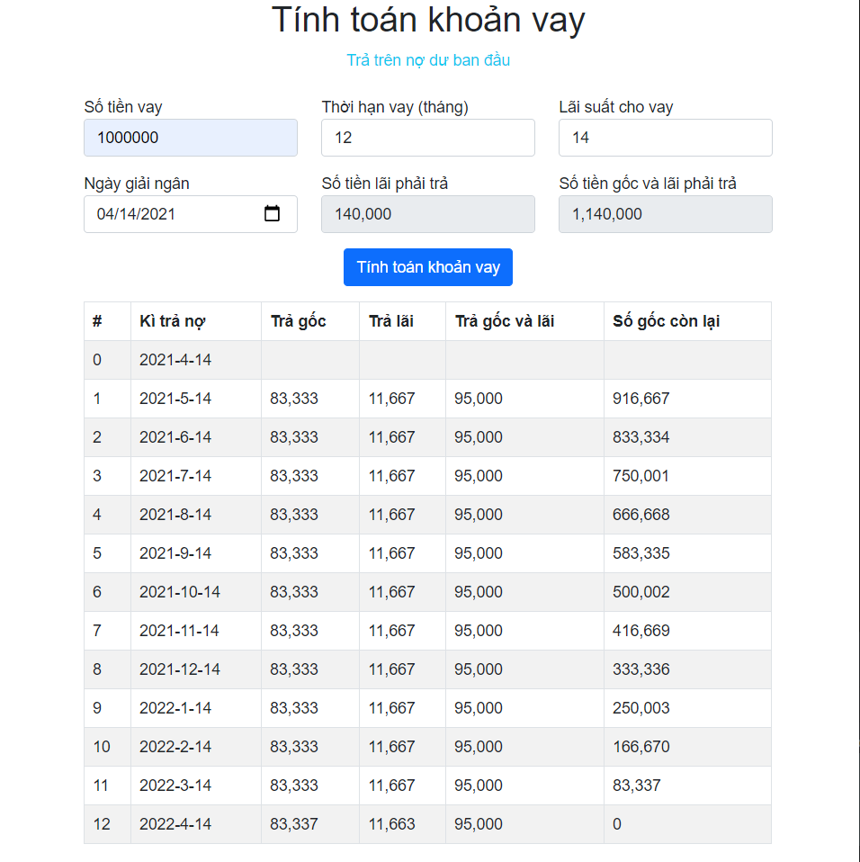

# Phân tích bài toán

Bài tập mô phỏng công cụ tính toán khoản vay của [Agribank](https://www.agribank.com.vn/vn/cong-cu-tinh-toan)

## Về kì trả nợ

- Mỗi tháng sẽ trả gốc dựa trên số tiền vay chia đều cho số tháng vay
- Mỗi tháng sẽ trả lãi dựa trên tổng số lãi chia đều cho số tháng vay
- Kì trả nợ sẽ được tính là 1 tháng.

  Ví dụ: 2021-3-31 thì 1 tháng sau sẽ là 2021-5-1 (vì không có ngày 2021-4-31), 1 tháng tiếp theo là 2021-6-1.

## Công thức

- Trả lãi hàng tháng (interest per month): `Math.round((số tiền vay * lãi suất)/1200)`
- Tổng số tiền lãi phải trả: `Math.round((số tiền vay * lãi suất * thời hạn vay)/1200)`
- Trả gốc hàng tháng: `Math.round(số tiền vay / thời hạn vay)`
- Gốc còn lại tháng i (original per month): `số tiền vay - Trả gốc hàng tháng * i`
