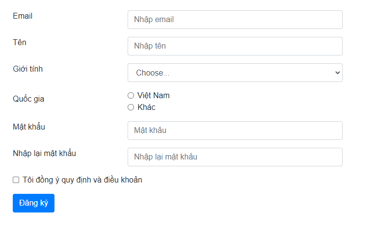

# Project validate

Tạo một form như hình


## Rule validate

- Email: required, email
- Tên: required, là tên người (tiếng anh hoặc tiếng việt không chứa số), max 50 ký tự
- Giới tính: required
- Quốc gia: required
- Mật khẩu: required, min 8, max 20
- Nhập lại mật khẩu: required, min 8, max 20, giống mật khẩu
- Đồng ý: required

## Gợi ý

- Email: duthanhduoc+01@gmail-vn.com
  Tên email thì gồm chữ, số, `.`, `-`, `_`. Domain email từ 1-63 ký tự bao gồm chữ cái, số, `.` và `-`, tên miền thì từ 1-5 ký tự
- Bao gồm chữ tiếng Việt thì: `[A-Za-z\u00C0-\u024F\u1E00-\u1EFF]`

```js
const REGEX_EMAIL = /^([a-zA-Z0-9\.\_\-]+)(\+([0-9]+))?@([a-zA-Z0-9\.\-]+){1,63}\.[a-zA-Z]{1,5}$/
const REGEX_NAME = /[A-Za-z\u00C0-\u024F\u1E00-\u1EFF]+(\s?[A-Za-z\u00C0-\u024F\u1E00-\u1EFF]+)+$/
```
