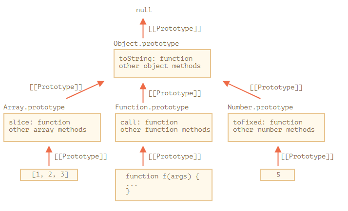

# Native Prototypes

Thuộc tính `"prototype"` được sử dụng rỗng rãi trong Javascript. Mọi constructor function có sẵn của JS đều sử dụng nó.

Đến đây có thể mọi người đã bị loạn não nên mình sẽ nhắc lại.

- `[[Prototype]]` là một thuộc tính ẩn trong object(function) đại diện trong prototype **thực tế**.
- `__proto__` là getter/setter truy cập đến `[[Prototype]]`
- Thuộc tính `"prototype"` tồn tại trong constructor function nó là một thuộc tính bình thường, không phải là `[[Prototype]]`. Nó giúp chúng ta kế thừa khi tạo object từ constructor function.

## Object.prototype

Cùng nói về một object rỗng

```javascript
let obj = {}
console.log(obj.toString()) // "[object Object]"
```

Khoan đã! Chúng ta không hề thấy phương thức `toString` được khai báo trong `obj`. `obj` là object rỗng cơ mà.
Đầu tiên là `obj={}` thì tương tự như `obj = new Object()`, mà `Object` là một constructor function được xây dựng sẵn trong JS. `Object` có thuộc tính `prototype` tham chiếu đến một object khổng lồ với nhiều phương thức và `toString` cũng nằm trong đó.

Khi `new Object()` được gọi (hoặc literal object `{...}` được tạo), `[[Prototype]]` của nó sẽ được set là `Object.prototype`

Vì thế khi `obj.toString()` được gọi thì thực chất là lấy `toString()` từ `Object.prototype`

Chúng ta có thể kiểm tra

```javascript
let obj = {}

alert(obj.__proto__ === Object.prototype) // true

alert(obj.toString === obj.__proto__.toString) //true
alert(obj.toString === Object.prototype.toString) //true
```

Có một lưu ý là không còn một `[[Prototype]]` nào trong chuỗi `Object.prototype` nữa

```javascript
alert(Object.prototype.__proto__) // null
```

# Các prototype được dựng sẵn khác

Các prototype được dựng sẵn khác như là `Array`, `Date`, `Function` và số khác cũng giữ trong mình các phương thức trong prototype.

Khi chúng ta tạo một array `[1, 2, 3]`, mặc định `new Array()` sẽ được sử dụng. Vì thế `Array.prototype` sẽ trở thành prototype của nó và cung cấp các phương thức cho nó. Điều này vô cùng tiện lợi.

Như mô tả thì tất cả các prototype được xây dựng sẵn đều có `Object.prototype` trên đỉnh. Đó là lý do tại sao một số người nói rắng `mọi thứ đều kế thừa từ object`.

Đây là một bức tranh tổng thể (Ví dụ cho 3 prototype)



Cùng kiểm tra bằng tay

```javascript
let arr = [1, 2, 3]

// it inherits from Array.prototype?
alert(arr.__proto__ === Array.prototype) // true

// then from Object.prototype?
alert(arr.__proto__.__proto__ === Object.prototype) // true

// and null on the top.
alert(arr.__proto__.__proto__.__proto__) // null
```

Một số phương thức trong prototype có thể bị trùng nhau, ví dụ `Array.prototype` có `toString()`, nhưng `Object.prototype` cũng có `toString`. Trong trường hợp này thì nó sẽ chọn cái gần hơn.

```javascript
let arr = [1, 2, 3]
console.log(arr.toString()) // Kết quả của Array.prototype.toString
```

## Primitives - Kiểu nguyên thủy

Phần phức tạp nhất lại xảy ra với String, number, boolean.
Như chúng ta biết thì chúng không phải là các object. Nhưng nếu chúng ta có thể truy cập đến các thuộc tính của chúng theo những cách dưới đây

```javascript
let a = 1
a.toString()
;(2).toString()
Number(2).toString() // tạo bằng object wrapper
```

Những object này được tạo ẩn và JS engine tối ưu chúng, vì thế ta vẫn có `String.prototype`, `Number.prototype` và `Boolean.prototype`.

Có thể nói string, number, boolean là kiểu nguyên thủy, không phải object và không bị tham chiếu. Còn về bản chất thì chúng cũng là object.

Lưu ý: `null` và `undefined` không có các object wrapper, chúng là những giá trị đặc biệt vì thế không có thuộc tính hay prototype.

## Thay đổi prototype sơ khai

Chúng ta có thể thay đổi prototype, nếu thêm phương thức `show` vào `String.prototype` thì tất cả các string đều có thể được dùng phương thức này.

```javascript
String.prototype.show = function () {
  alert(this)
}

'BOOM!'.show() // BOOM!
```

Nhưng đây thường là một ý tưởng tồi tệ. Bởi vì các prototype như thế này là toàn cục (global), vậy nên nó dễ bị đè lên nhau. Nếu có 2 thư viện thêm phương thức `String.prototype.show`, thì sẽ có một phương thức bị đè lên và dẫn đến sai lệch.

Trong lập trình hiện đại, chỉ có một trường hợp duy nhất mà chúng ta sửa đổi các prototype sơ khai là **polyfilling**

Polyfilling thực ra chỉ là một cách thêm các phương thức mà JS engine hiện tại không hỗ trợ.

## Mượn từ prototype

Ví dụ object `obj` không có phương thức `join`, ta có thể mượn nó từ `Array.prototype.join`. Sở dĩ `join` cũng hoạt động được trong object vì thuật toán bên trong phương thức `join` chỉ quan tâm đến các index đúng và thuộc tính `length`

```js
let obj = {
  0: 'Hello',
  1: 'world!',
  length: 2
}

obj.join = Array.prototype.join

alert(obj.join(',')) // Hello,world!
```

Một cách tiếp cận khác là kế thừa bằng cách set `obj.__proto__` là `Array.prototype`, vì thế tất cả phương thức của `Array` tự động có sẵn ở `obj`.

Có một điều lưu ý là chúng ta chỉ có thể kế thừa một object tại một thời điểm, trong trường hợp chúng ta kế thừa `Array.prototype` thì có thể bạn nghĩ chúng ta sẽ mất `Object.prototype` nhưng may thay thì `Array.prototype` kế thừa `Object.prototype` nên chúng ta không bị mất `Object.prototype`.

Mượn thuộc tính thì khá linh hoạt, nó cho phép chúng ta thêm bớt các tính năng từ các object khác nhau nếu cần thiết.
