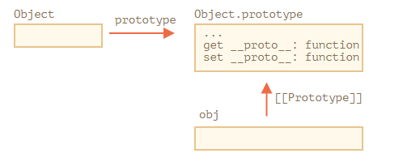

# Prototype methods, objects without **proto**

Trong bài đầu của chương này, chúng ta đã đề cập đến các phương thức hiện đại để setup một prototype.

`__proto__` được cho là đã bị loại bỏ (chỉ các trình duyệt còn dữ lại)

Các phương thức hiện đại đó là:

- [Object.create(proto, [descriptors])](https://developer.mozilla.org/en-US/docs/Web/JavaScript/Reference/Global_Objects/Object/create) - Tạo một object rỗng với việc cung cấp `proto` như `[[Prototype]]` và tùy chọn là các bộ mô tả thuộc tính (property descriptors)
- [Object.getPrototypeOf(obj)](https://developer.mozilla.org/en-US/docs/Web/JavaScript/Reference/Global_Objects/Object/getPrototypeOf) - return về `[[Prototype]]` của `obj`
- [Object.setPrototypeOf(obj, proto)](https://developer.mozilla.org/en-US/docs/Web/JavaScript/Reference/Global_Objects/Object/setPrototypeOf) - set `[[Prototype]]` của `obj` thành `proto`

Chúng nên được sử dụng thay vì `__proto__`
Ví dụ:

```javascript
let animal = {
  eats: true
}

// Tạo một object mới với animal như một prototype
let rabbit = Object.create(animal)

console.log(rabbit.eats) // true

console.log(Object.getPrototypeOf(rabbit) === animal) // true

Object.setPrototypeOf(rabbit, {}) // thay đổi prototype của rabbit thành {}
```

`Object.create` có một tham số tùy chọn thứ hai là: bộ mô tả thuộc tính. Chúng ta có thể cung cấp thêm các thuộc tính cho object như thế này:

```javascript
let animal = {
  eats: true
}

let rabbit = Object.create(animal, {
  jumps: {
    value: true
  }
})

console.log(rabbit.jumps) // true
```

Các bộ mô tả thì có cùng cấu trúc như đã mô tả ở bài 1.
Chúng ta có thể sử dụng `Object.create` để tạo một object clone thay vì dùng `for...in`:

```javascript
let clone = Object.create(
  Object.getPrototypeOf(obj),
  Object.getOwnPropertyDescriptors(obj)
)
```

Điều này có thể copy chính xác một `obj`, bao gồm tất cả thuộc tính: có thể liệt kê và không liệt kê, thuộc tính dữ liệu và setter/getter - mọi thứ, và với chính xác `[[Prototype]]`

## Tóm tắt lịch sử

Như đã thấy thì chúng ta có nhiều cách để quản lý `[[Prototype]]`. Nhiều cách để làm cùng 1 thứ.
Tại sao?
Sau đây là nguyên nhân lịch sử

- Thuộc tính `prototype` của constructor function đã có từ xa xưa
- Sau đó, vào năm 2012, `Object.create` xuất hiện trong JS tiêu chuẩn. Nó cung cấp khả năng tạo một object với một prototype được cung cấp, nhưng không cung cấp khả năng get/set nó. Vì thế các trình duyệt thêm một thuộc tính "không thuộc JS tiêu chuẩn" là `__proto__` để cho phép người dùng có thể get/set một prototype bất cứ lúc nào.
- Sau đó, vào năm 2015, `Object.setPrototypeOf` và `Object.getProtypeOf` được thêm vào JS tiêu chuẩn, để thực hiện chức năng tương tự như`**proto**`.

Tại sao `__proto__` bị thay thế bởi các hàm `getPrototypeOf/setPrototypeOf`? Đây là một câu hỏi thú vị, đòi hỏi chúng ta phải hiểu tại sao `__proto__` khá tệ. Đọc thêm để biết câu trả lời.

**Đừng thay đổi `[[Prototype]]` trên các object đang tồn tại nếu quan tâm đến vấn đề tốc độ**
Về mặt kỹ thuật, chúng ta có thể get/set `[[Prototype]]` bất kỳ lúc nào. Nhưng thường thì chúng ta chỉ set một lần khi object khởi tạo và không thay đổi nó nữa: `rabbit` kế thừa từ `animal`, và nó sẽ không thay đổi.

Và các Javascript engine được tối ưu hóa cao cho việc này. Thay đổi một prototype "đang hoạt động" với `Object.setPrototypeOf` hoặc `obj.__proto__=` là một phép tất rất chậm bởi vì nó phá vỡ sự tối ưu hóa nội bộ cho các hoạt động truy cập đến thuộc tính object. Vì thế tránh sử dụng nó nếu bạn không biết nó làm gì, hoặc tốc độ Javasript không phải là vấn đề bạn quan tâm.

## "Very plain" objects - Các Object rất đơn giản

Như chúng ta đã biết, các object có thể được sử dụng để lưu trữ các cặp key/value
Nhưng nếu chúng ta cố tình lưu trữ một key do người dùng cung cấp (ví dụ người dùng nhập), chúng ta sẽ thấy một điều thú vị là: tất cả các key đều hoạt động tốt ngoại trừ `"__proto__"`.

```javascript
let obj = {}

let key = prompt("What's the key?", '__proto__')
obj[key] = 'some value'
alert(obj[key]) // [object Object], không phải là "some value"!
```

Ở đây, nếu người dùng nhập là `__proto__`, hành động gán ở trên sẽ bị bỏ qua.
Điều này không làm chúng ta ngạc nhiên lắm. `__proto__` là một thuộc tính đặc biệt: nó nên là object hoặc `null`. Một string không thể trở thành một prototype.

Giả sử chúng ta không có ý định set prototype của object. Chúng ta chỉ muốn lưu cặp key/value và key được đặt tên là `"__proto__"`. Vậy nên đây là bug!

Trong ví dụ bên trên, hậu quả gây ra không nghiêm trọng lắm. Nhưng trong một số trường hợp khác, chúng ta có thể gán value cho object, và sau đó prototype có thể bị thay đổi. Kết quả là việc thực thí có thể bị sai theo cách không mong muốn.

Điều tồi tệ hơn là các dev thường không nghĩ về khả năng này. Điều đó làm cho những lỗi như vậy khó nhận ra và thậm chí biến chúng thành các lỗ hổng bảo mật, đặt biệt là khi Javascript được sử dụng ở phía máy chủ.

Làm thế nào để tránh vấn đề này?

Đầu tiên, chúng ta chỉ cần chuyển qua sử dụng `Map` để lưu trữ thay vì một plain object, mọi thứ sẽ hoạt động tốt.

Nhưng `Object` cũng có thể giúp được, vì các nhà sáng lập ngôn ngữ đã nghĩ đến trường hợp này từ lâu rồi.

`__proto__` không phải là một thuộc tính dữ liệu của object, nó là thuộc tính bộ truy cập của `Object.prototype`:



Vì thế, nếu `obj.__proto__` được get hay set, tương ứng với việc getter/setter được gọi từ `[[Prototype]]`

Như đã nói ở đầu chương: `__proto__` là cách để truy cập vào `[[Prototype]]`, nó không phải là `[[Prototype]]`

Bây giờ, nếu chúng ta có ý định sử dụng một object mà không gặp vấn đề như trên, chúng ta có thể làm điều đó với một mẹo nhỏ:

```javascript
let obj = Object.create(null)

let key = prompt("What's the key?", '__proto__')
obj[key] = 'some value'

alert(obj[key]) // "some value"
```

`Object.create(null)` tạo một object trống mà không có prototype (`[[Prototype]]` là `null`)

Vì thế, không có getter/setter `__proto__`. Bây giờ thì quá trình hoạt động bình thường/

Chúng ta có thể gọi những object như này là "very plain" hoặc "pure dictionnary" object, bởi vì chúng còn đơn giản hơn một plain object `{...}`

Nhược điểm của các object như vậy là thiếu các phương thức có sẵn, ví dụ `toString`:

```javascript
let obj = Object.create(null)

alert(obj) // Error (no toString)
```

Để ý rằng hầu hết các phương thức object liên quan kiểu `Object.something(...)` như `Object.keys(obj)` - Chúng thuộc về `Object` to bự, nên vẫn hoạt động bình thường.

```js
let chineseDictionary = Object.create(null)
chineseDictionary.hello = '你好'
chineseDictionary.bye = '再见'

alert(Object.keys(chineseDictionary)) // hello,bye
```

## Tóm lại

Các phương thức hiện đại để setup và truy cập trực tiếp vào prototype là:

- [Object.create(proto, [descriptors])](https://developer.mozilla.org/en-US/docs/Web/JavaScript/Reference/Global_Objects/Object/create) - Tạo một object rỗng với việc cung cấp `proto` như `[[Prototype]]` và tùy chọn là các bộ mô tả thuộc tính (property descriptors)
- [Object.getPrototypeOf(obj)](https://developer.mozilla.org/en-US/docs/Web/JavaScript/Reference/Global_Objects/Object/getPrototypeOf) - return về `[[Prototype]]` của `obj`
- [Object.setPrototypeOf(obj, proto)](https://developer.mozilla.org/en-US/docs/Web/JavaScript/Reference/Global_Objects/Object/setPrototypeOf) - set `[[Prototype]]` của `obj` thành `proto`

getter/setter bằng `__proto__` thì không an toàn nếu chúng ta muốn người dùng tự tạo key cho object. Bởi vì nếu người dùng nhập `"__proto__"` như là key, và nó sẽ gây ra lỗi, và đôi khi sẽ gây ra các kết quả không mong muốn.

Vì thế chúng ta có thể sử dụng `Object.create(null)` để tạo một "very plain" object mà không có `__proto__`, hoặc chuyển qua `Map` object.

Cũng như `Object.create` cung cấp một cách dễ dàng để shallow-copy một object với tất cả descriptor (bộ mô tả)

```js
let clone = Object.create(
  Object.getPrototypeOf(obj),
  Object.getOwnPropertyDescriptors(obj)
)
```

Chúng ta cũng cần rõ ràng là `__proto__` là getter/setter cho `[[Prototype]]` và nằm trong `Object.prototype`, như là các phương thức khác.

Chúng ta có thể tạo một object mà không có prototype bằng cách `Object.create(null)`. Những object như vậy được sử dụng như là "pure dictionaries", chúng không có vấn đề gì với key `"__proto__"`.

Các phương thức khác:

- [Object.keys(obj)](https://developer.mozilla.org/en-US/docs/Web/JavaScript/Reference/Global_Objects/Object/keys) / [Object.values(obj)](https://developer.mozilla.org/en-US/docs/Web/JavaScript/Reference/Global_Objects/Object/values) / [Object.entries(obj)](https://developer.mozilla.org/en-US/docs/Web/JavaScript/Reference/Global_Objects/Object/entries) – Trả về một mảng về keys/values/cặp key-values (chỉ các thuộc tính có thể đếm)

Tất cả các phương thức mà return về thuộc tính object (như `Object.keys` và một số khác) - chỉ return về thuộc tính của nó. Nếu chúng ta muốn các thuộc tính mà nó kế thừa, chúng ta có thể sử dụng `for...in`
