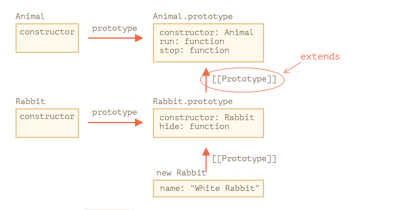

# Class inheritance - kế thừa lớp

Kế thừa lớp là cách mà một lớp mở rộng một lớp khác.

## Từ khóa "extends"

Chúng ta có class `Animal`

```js
class Animal {
  constructor(name) {
    this.speed = 0
    this.name = name
  }
  run(speed) {
    this.speed = speed
    alert(`${this.name} runs with speed ${this.speed}.`)
  }
  stop() {
    this.speed = 0
    alert(`${this.name} stands still.`)
  }
}

let animal = new Animal('My animal')
```

Cùng tạo `class Rabbit` kế thừa từ `Animal`:

```js
class Rabbit extends Animal {
  hide() {
    alert(`${this.name} hides!`)
  }
}

let rabbit = new Rabbit('White Rabbit')

rabbit.run(5) // White Rabbit runs with speed 5.
rabbit.hide() // White Rabbit hides!
```

Object của class `Rabbit` có thể truy cập được các phương thức bên trong `Rabbit` cũng như `Animal`.

Thực ra bên trong, `extends` sử dụng cơ chế prototype.



Ví dụ, để tìm phương thức `rabbit.run`, engine kiểm tra:

1. object `rabbit` (không có `run`)
2. prototype của nó, đó là `Rabbit.prototype` (cũng không có `run`)
3. prototype của nó, đó là `Animal.prototype`, cuối cùng chạy phương thức `run`.

**Cú pháp như này được chấp nhận**

```js
function f(phrase) {
  return class {
    sayHi() {
      alert(phrase)
    }
  }
}

class User extends f('Hello') {}

new User().sayHi() // Hello
```

Điều này sẽ hữu dụng khi chúng ta muốn kế thừa dựa vào điều kiện nào đó.

## Ghi đè một phương thức

Điều gì sẽ xảy ra nếu class Rabbit và Animal đều trùng tên phương thức
Ví dụ như phương thức `stop()` phía dưới

```js
class Rabbit extends Animal {
  stop() {
    // ...Bây giờ nó sẽ sử dụng rabbit.stop()
    // thay vì stop() từ Animal
  }
}
```

Thường thì chúng ta không muốn thay thế hoàn toàn phương thức cha, chúng ta muốn kế thừa trên phương thức cha, ví dụ như gọi phương thức cha rồi thêm một số hiệu ứng khác nữa.

Class cung cấp từ khóa `"super"` giúp chúng ta thực hiện điều này/

- `super.method(...)` để gọi một phương thức cha
- `super(...)` để gọi một constructor cha (bên trong constructor của chúng ta)

Ví dụ

```js
class Animal {
  constructor(name) {
    this.speed = 0
    this.name = name
  }

  run(speed) {
    this.speed = speed
    alert(`${this.name} runs with speed ${this.speed}.`)
  }

  stop() {
    this.speed = 0
    alert(`${this.name} stands still.`)
  }
}

class Rabbit extends Animal {
  hide() {
    alert(`${this.name} hides!`)
  }

  stop() {
    super.stop() // call parent stop
    this.hide() // and then hide
  }
}

let rabbit = new Rabbit('White Rabbit')

rabbit.run(5) // White Rabbit runs with speed 5.
rabbit.stop() // White Rabbit stands still. White Rabbit hides!
```

**Arrow function không có `super`**

Nếu được truy cập, nó sẽ lấy bên ngoài function: ví dụ

```js
class Rabbit extends Animal {
  stop() {
    setTimeout(() => super.stop(), 1000) // Gọi stop từ Aniaml sau 1 giây
  }
}
```

`super` trong arrow function thì giống như bên trong `stop()`. Nếu chúng ta sử dụng một function thông thường ở đây, sẽ gây lỗi

```js
// Unexpected super
setTimeout(function () {
  super.stop()
}, 1000)
```

## Ghi đè constructor

Với constructor thì hơi phức tạp một chút.

Cho đến bây giờ thì `Rabbit` không có `constructor` của chính nó.

Nếu một class không có constructor mà kế thừa một class khác, thì một constructor trống sẽ được tạo ra như thế này

```js
class Rabbit extends Animal {
  // Tạo ra từ những class mà không có constructor của nó
  constructor(...args) {
    super(...args)
  }
}
```

Như chúng ta đã thấy, nó gọi một `constructor` và truyền các tham số vào.

Tiếp theo cùng xem ví dụ dưới

```js
class Animal {
  constructor(name) {
    this.speed = 0
    this.name = name
  }
  // ...
}

class Rabbit extends Animal {
  constructor(name, earLength) {
    this.speed = 0
    this.name = name
    this.earLength = earLength
  }

  // ...
}

// Doesn't work!
let rabbit = new Rabbit('White Rabbit', 10) // Error: this is not defined.
```

Chúng ta nhận được một lỗi. Bây giờ chúng ta không thể tạo rabbit. Sai ở đâu?

Câu trả lời là
**constructor trong class kế thừa phải gọi `super(...)`, và làm điều này trước khi sử dụng `this`**

Vậy để fix điều này, chúng ta cần làm như sau

```js
class Animal {
  constructor(name) {
    this.speed = 0
    this.name = name
  }

  // ...
}

class Rabbit extends Animal {
  constructor(name, earLength) {
    super(name)
    this.earLength = earLength
  }

  // ...
}

// now fine
let rabbit = new Rabbit('White Rabbit', 10)
alert(rabbit.name) // White Rabbit
alert(rabbit.earLength) // 10
```

## Ghi đè các class field

Chúng ta không chỉ có thể ghi đè các phương thức mà còn có thể ghi đè các class field

Mặc dầu sẽ có một số phức tạp, ví dụ

```js
class Animal {
  name = 'animal'

  constructor() {
    alert(this.name) // (*)
  }
}

class Rabbit extends Animal {
  name = 'rabbit'
}

new Animal() // animal
new Rabbit() // animal
```

Ở đây, class `Rabbit` kế thừa từ `Animal` và ghi đè trường `name`.

`Rabbit` không có constructor của nó, vì thế `Animal` constructor được gọi.

Điều thú vị trong cả 2 trường hợp: `new Animal()` và `new Rabbit()`, `alert` ở dòng `*` hiển thị `animal`.

**Nói cách khác, constructor cha luôn sử dụng giá trị trường (field) của nó, không phải từ kế thừa**

Điều này chỉ xảy ra với class fields, không có ở các phương thức.

```js
class Animal {
  showName() {
    // instead of this.name = 'animal'
    alert('animal')
  }

  constructor() {
    this.showName() // instead of alert(this.name);
  }
}

class Rabbit extends Animal {
  showName() {
    alert('rabbit')
  }
}

new Animal() // animal
new Rabbit() // rabbit
```

Lưu ý rằng output bây giờ khác nhau.

Và đó là những gì chúng ta mong muốn một cách tự nhiên. Khi constructor cha được gọi trong class kế thừa, nó sử dụng phương thức đã bị ghi đè.

Nhưng với class field thì không. Đó là bởi vì thứ tự khởi tạo field. Class field được khởi tạo:

- Trước constructor cho class cơ bản (mà không kế thừa bất cứ thứ gì)
- Ngay lập tức sau khi `super()` được gọi ở class kế thừa.

Trong trường hợp chúng ta, `Rabbit` là class kế thừa. Không có `constructor()` bên trong nó. Như đã nói từ trước, điều này giống như thể tạo một constructor rỗng với chỉ `super(...args)` bên trong.

Vì thế, `new Rabbit()` gọi `super()`, constructor cha được gọi, và ngay sau đó thì class field được khởi tạo. Tại thời điểm constructor cha thực thi, chưa có class field `Rabbit`, đó là lý do tại sao `Animal` field được sử dụng.

Đây là sự khác biết giữa field và method trong javascript.

Nếu đó là vấn đề, chúng ta có thể fix nó bằng cách sử dụng các phương thức (method) hoặc getter/setter thay vì trường (field)
