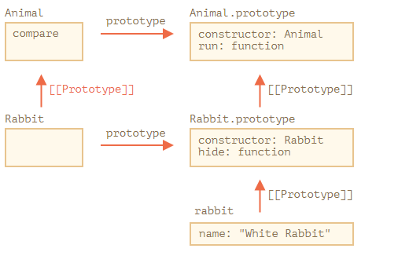

# Thuộc tính và phương thức static

Với từ khóa `static`, chúng ta có thể tạo các phương thức và các thuộc tính gọi trực tiếp bằng class mà không cần thông qua việc khởi tạo Object mới bằng `new`

Ví dụ:

```js
class User {
  static staticMethod() {
    alert(this === User)
  }
}

User.staticMethod() // true
```

Điều này thì tương tự việc gán trực tiếp như thế này

```js
class User {}

User.staticMethod = function () {
  alert(this === User)
}

User.staticMethod() // true
```

Chúng ta thường dùng `static` trên các phương thức thuộc về class, chứ không phải thuộc về bất cứ object nào

Ví dụ:

```js
class Article {
  constructor(title, date) {
    this.title = title
    this.date = date
  }

  static compare(articleA, articleB) {
    return articleA.date - articleB.date
  }
}

// usage
let articles = [
  new Article('HTML', new Date(2019, 1, 1)),
  new Article('CSS', new Date(2019, 0, 1)),
  new Article('JavaScript', new Date(2019, 11, 1))
]

articles.sort(Article.compare)

alert(articles[0].title) // CSS
```

Tại đây, `Article.compare` thực hiện so sánh các object. Nó không phải là phương thức của một article, mà là của cả class.

## Thuộc tính static

Tính năng này được thêm gần đây vào trong Javascript.

```js
class Article {
  static publisher = 'Ilya Kantor'
}

alert(Article.publisher) // Ilya Kantor
```

Chúng ta có thể làm điều tương tự bằng cách gán trực tiếp

```js
Article.publisher = 'Ilya Kantor'
```

## Kế thừa thuộc tính và phương thức tĩnh

Thuộc tính và phương thức tĩnh cũng có thể được kế thừa.

Ví dụ, `Animal.compare` và `Animal.planet` bên dưới được kế thừa và có thể truy cập từ `Rabbit.compare` và `Rabbit.planet`:

```js
class Animal {
  static planet = 'Earth'

  constructor(name, speed) {
    this.speed = speed
    this.name = name
  }

  run(speed = 0) {
    this.speed += speed
    alert(`${this.name} runs with speed ${this.speed}.`)
  }

  static compare(animalA, animalB) {
    return animalA.speed - animalB.speed
  }
}

// Inherit from Animal
class Rabbit extends Animal {
  hide() {
    alert(`${this.name} hides!`)
  }
}

let rabbits = [new Rabbit('White Rabbit', 10), new Rabbit('Black Rabbit', 5)]

rabbits.sort(Rabbit.compare)

rabbits[0].run() // Black Rabbit runs with speed 5.

alert(Rabbit.planet) // Earth
```

Bây giờ khi gọi `Rabbit.compare`, `Animal.compare` sẽ được gọi.

Nó hoạt động như thế nào? Một lần nữa, sử dụng prototype. Như các bạn có thể đoán, `extends` cho `[[Prototype]]` của `Rabbit` tham chiếu đến `Animal`.



Vậy nên, `Rabbit extends Animal` tạo 2 `[[Prototype]]` tham chiếu:

1. `Rabbit` function kế thừa `[[Prototype]]` từ `Animal` function.
2. `Rabbit.prototype` kế thừa `[[Prototype]]` từ `Animal.prototype`

Đây là đoạn code kiểm tra.

```js
class Animal {}
class Rabbit extends Animal {}

// for statics
alert(Rabbit.__proto__ === Animal) // true

// for regular methods
alert(Rabbit.prototype.__proto__ === Animal.prototype) // true
```

**Lưu ý cho những ai hay nhầm lẫn `__proto__`, `prototype`, `[[Prototype]]`**

- `__proto__` là getter truy cập trực tiếp đến prototype (`[[Prototype]]`) của một object. Hay nói cách khác `__proto__` đại diện cho `[[Prototype]]`.
- `prototype` chỉ là tên gọi một thuộc tính được tồn tại sẵn có trên function. `prototype` cho phép chúng ta thực hiện kế thừa thông qua nó (khá giống `__proto__`), nhưng nó không đại diện cho `[[Prototype]]`.
