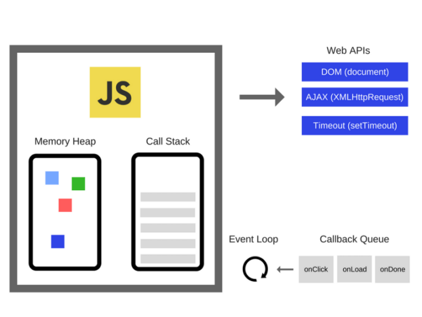
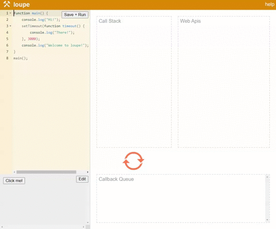
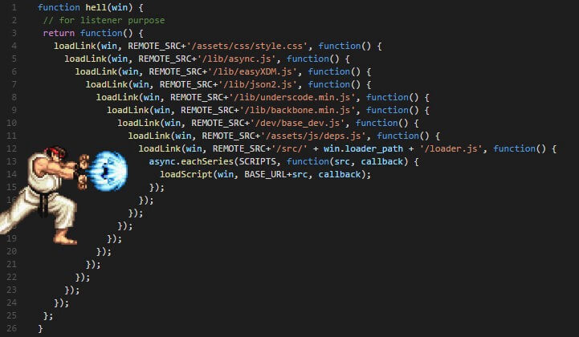
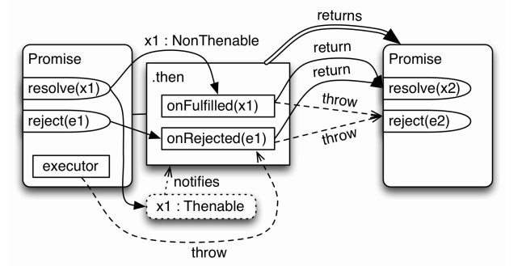
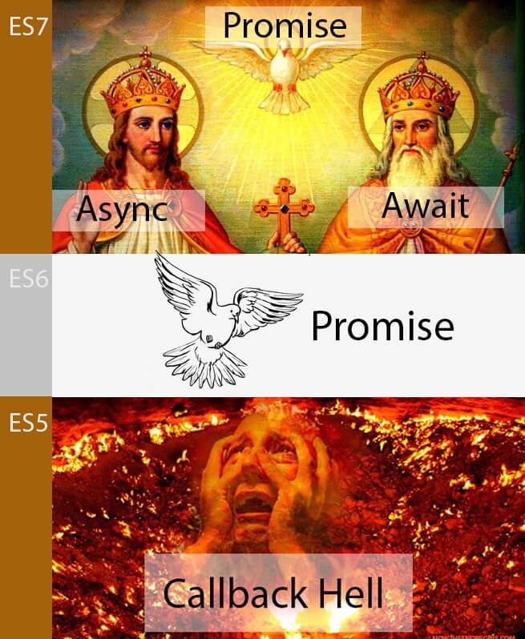

# Bất đồng bộ callback, promise, async await trong Javascript

Bài gốc từ xdevclass: [Phần 4: Bất đồng bộ callback, promise, async await trong Javascript](https://xdevclass.com/phan-4-bat-dong-bo-callback-promise-async-await-trong-javascript/)

## Lập trình bất đồng bộ

- Cả môi trường trình duyệt và Node.js, Javascript đều chạy **đơn luồng**

- Trong những chương trình đồng bộ, nếu bạn có 2 dòng code theo thứ tự **L1**, **L2** thì **L2** không thể bắt đầu chạy nếu **L1** chưa chạy xong.
- Trong những chương trình bất đồng bộ, nếu bạn cũng có 2 dòng code theo thứ tự **L1**, **L2**. Trong khi **L1** sẽ được thực hiện một số tác vụ và hoàn thành trong tương lai thì **L2** có thể chạy trước khi **L1** hoàn thành.

### Call Stack

**Call Stack** là một cấu trúc dữ liệu dạng ngăn xếp (stack) dùng để chứa thông tin về hoạt động của chương trình máy tính trong lúc thực thi. **Call stack** hoạt động theo kiểu **LIFO** (Last In First Out) tức là thằng vào sau cùng nhưng sẽ được thực hiện và thoát ra khỏi ngăn xếp đầu tiên.

Ví dụ đoạn code dưới đây

```js
function a(x) {
  console.log(x)
}
function b(y) {
  a(y + 2)
}
function c(z) {
  b(z + 1)
}
c(5)
```

Khi chạy đoạn code trên, ta sẽ có call stack trong Javascript được mô tả như thế này:
Call Stack:

1. a()
2. b()
3. c()

Tức là khi **a()** thực hiện xong, nó sẽ bị xóa khỏi call stack. **b()** được thực hiện và xóa khỏi call stack. **c()** được thực hiện và xóa khỏi call stack. Lúc này call stack trống thì chương trình đã thực hiện xong.

### Event Loop và Callback queue

Trong một **Javascript Runtime** (môi trường chạy JS) còn có một số thứ khác quan trọng không kém **Call Stack** như **Web APIs, Event Loop, Callback Queue**.



Một ví dụ trực quan về cách hoạt động của Event Loop và Callback Queue

```js
function main() {
  console.log('Hi!')
  setTimeout(function timeout() {
    console.log('There!')
  }, 3000)
  console.log('Welcome to loupe!')
}
main()
```

Đoạn code trên sẽ thực hiện như sau

- `console` sẽ in `"Hi!"` ra đầu tiên
- `setTimeout` được gọi = > đẩy async callback là `timeout` vào **Web Apis**. Cho `timeout` đợi 3s
- `console` sẽ in ra `"Welcome to loupe!"`
- Sau khi đợi 3s xong thì `"There!"` mới xuất hiện



Mọi người ai coi không kịp thì có thể vào [trang này để test](http://latentflip.com/loupe).

Nếu để ý thì các bạn có thể thấy sau khi hàm `main` chạy xong và biến khỏi call stack thì `timeout` với `console.log("There!")` lại được đẩy vô.

Như mình đã đề cập bên trên, Javascript thì có **call stack** nhưng môi trường để chạy Javascript (Browser, NodeJs) thì còn có thêm các **WebAPIs, event loop** và **callback queue**. Và những thứ này hoạt động trên một luồng riêng biệt và được đảm bảo về tính thống nhất.

Vậy nên mình có thể tóm gọn lại như sau

- Sự thật thì tất cả code Javascript thực hiện đồng bộ, **event loop** cho phép chúng vào hàng đợi và thực hiện các đoạn code tiếp theo.
- Javascript sử dụng **đơn luồng**, nhưng môi trường để chạy Javascript thì hoạt động **đa luồng**.

Event loop là chủ đề nâng cao trong JS, mình nghĩ ae mới học hiểu như vậy là đủ rồi. Nếu muốn tìm hiểu sâu hơn thì có thể [xem video này](https://www.youtube.com/watch?v=8aGhZQkoFbQ)

## async callback

Bất đồng bộ callback xuất hiện rất nhiều ở Javascript

- Ưu điểm: Dễ hiểu (vì chỉ là một callback function đơn giản)
- Nhược điểm: Khó khăn trong việc xử lý lỗi. Code bị lồng vào nhau quá nhiều (callback hell)

Lắng nghe sự kiện click. Khi được click thì mới chạy callback function

```js
document.getElementById('myBtn').addEventListener('click', displayDate)
function displayDate() {
  document.getElementById('demo').innerHTML = Date()
}
```

Đọc file trong Node.js. Khi đọc file hoàn tất thì mới chạy callback function bên trong.

```js
fs.readFile('demo.txt', (err, data) => {
  console.log(data)
})
```

Nhưng sẽ dễ bị xảy ra hiện tượng Callback Hell (tức là có quá nhiều callback lồng nhau) nếu chúng ta cần sử lý theo tuần tự.



### Sử dụng async callback gây khó khăn trong việc xử lý lỗi

```js
try {
  setTimeout(() => {
    throw new Error('Lỗi rồi')
  }, 1000)
} catch (error) {
  // Dòng này sẽ không bao giờ được chạy
  console.log(error)
}
```

## Promise ES6

**Promise** đơn giản nghĩa là lời hứa, trong tương lai có thể làm hoặc không làm một hành động gì đó (thất hứa)

Một Promise có 3 trạng thái sau:

- **pending**: đang chờ kết quả
- **fulfilled**: đã có kết quả
- **rejected**: lỗi xảy ra

### Tạo một Promise

```js
const p = new Promise(
  /* executor */
  function (resolve, reject) {
    // statements
  }
)
```

```js
const p = new Promise((resolve, reject) => {
  ...
  if(...) {
    resolve(value) // thành công
  } else {
    reject(reason) // thất bại
  }
})
```

### Xử lý trạng thái promise

```js
promise
  .then(
    (value) => {
      /* fulfillment */
    },
    (error) => {
      /* rejection */
    }
  )
  .catch((error) => {
    /* rejection */
  })
```

### Chuyển một async callback thành một promise.

Ví dụ về in ra `'hello'` sau 1s

```js
// async callback thông thường
setTimeout(() => {
  console.log('hello')
}, 1000)
// chuyển thành promise
const p = new Promise((resolve, reject) => {
  setTimeout(() => {
    resolve('hello')
  }, 1000)
})
p.then((value) => {
  console.log(value)
})
```

### Một số lưu ý khi dùng promise

_Promises are eager and not lazy_. Tức promise thực thi khi bạn khai báo chứ không phải là khi bạn sài `then()`. Khi sài `then()` chỉ là lúc bạn lấy kết quả

```js
let a = 1
const p = new Promise((resolve, reject) => {
  a++
})
console.log(a) // 2
```

Để tránh điều này thì bạn có thể wrap nó vào trong một function

```js
let a = 1
function runPromise() {
  const p = new Promise((resolve, reject) => {
    a++
  })
  return p
}
console.log(a) // 1
```

Một promise thì chỉ có thể rơi vào 1 trong 3 trạng thái như mình đã nêu trên. Không thể đã fulfilled rồi lại bị rejected được. Và sau khi thực hiện `resolve()` hay `reject()`, nếu có code phía dưới thì code đó vẫn được chạy. Ví dụ

```js
const p = new Promise((resolve, reject) => {
  resolve('done')
  // Code sẽ chạy nhưng sẽ không được đưa vào rejected
  reject(new Error('error'))
})
```

- `then` / `catch` luôn return về một promise

- return giá trị trong `onFulfilled` / `onRejected` sẽ đưa giá trị đó về trạng thái `onFulfilled` ở promise tiếp theo (tương tự thực hiện `resolve`)

- `throw` giá trị trong executor / onFulfilled / onReject sẽ đưa giá trị đó về trạng thái onRejected ở promise tiếp theo



```js
const p1 = new Promise((resolve, reject) => {
  resolve(1)
})
p1.then((result) => result * 2).then((result) => {
  console.log(result) // 2
})
const p2 = new Promise((resolve, reject) => {
  reject(new Error('Lỗi 404'))
})
p2.catch((error) => error).then((result) => {
  console.log(result.message) // Lỗi 404
})
```

```js
const p = new Promise((resolve, reject) => {
  throw new Error('Something wrong!')
})
p.catch((error) => {
  console.log(error.message) // Something wrong!
})
```

### Một số cách khác để tạo nhanh Promise

- `Promise.resolve()`
- `Promise.reject()`

### Một số pattern cần tránh với promise

#### thực hiện cho code chạy tuần tự gây nên callback hell

```js
asyncFunc1().then(function (value1) {
  asyncFunc2().then(function (value2) {
    // thực hiện gì đó
  })
})
```

Cách fix callback hell

```js
asyncFunc1()
  .then(function (value1) {
    return asyncFunc2()
  })
  .then(function (value2) {
    // thực hiện gì đó
  })
```

#### dư thừa khai báo promise

```js
function asyncFunc1() {
  return new Promise(function (resolve, reject) {
    asyncFunc2()
      .then(function (data) {
        // extra work with data
        resolve(data)
      })
      .catch(reject)
  })
}
```

cách fix dư thừa khai báo promise

```js
function asyncFunc1() {
  return asyncFunc2().then(function (data) {
    // extra work with data
    return data
  })
}
```

## Async/Await ES7

Nếu ở phiên bản ES6 thì promise có thể giải quyết được phần nào callback hell, nhưng vẫn chưa được triệt để. Đến ES7 chúng ta có thể xử lý bất đồng bộ một cách dễ nhìn và dễ đọc hơn với async/await.

**Chú ý**: Async/Await không thay thế promise mà nó kết hợp với promise để cho ra cú pháp dễ nhìn hơn. Vì thế để học async/await yêu cầu bạn phải hiểu được promise



**Async function**: Luôn luôn return một promise

```js
async function handle() {
  return 1
}
// tương tự
function handle() {
  return Promise.resolve(1)
}
```

**Await**: Chỉ hoạt động bên trong async function

```js
async function handle() {
  const promise = new Promise((resolve, reject) => {
    setTimeout(() => resolve('done!'), 1000)
  })
  // đợi cho đến khi promise resolves (*)
  const result = await promise
  console.log(result) // "done!"
}
handle()
```

### Không thể dùng await bên trong một function thường

```js
function handle() {
  const promise = new Promise((resolve, reject) => {
    setTimeout(() => resolve('done!'), 2000)
  })
  // SyntaxError
  const result = await promise
}
handle()
```

### Không phải cái gì cũng dùng await, await chỉ nên dùng cho promise

Đoạn code dưới đây là sự thừa thải, bạn không cần chuyển một function đồng bộ thành bất đồng bộ

```js
function sum(a, b) {
  return a + b
}
async function handle() {
  const result = await sum(1, 2)
  return result
}
handle().then((res) => {
  console.log(res)
})
```

### Xử lý lỗi với async/await

```js
async function getUser(username) {
  try {
    const response = await fetch(
      `https://api.github.com/search/users?q=${username}`
    )
    return await response.json()
  } catch (e) {
    throw e
  }
}
getUser('Duoc')
  .then((res) => console.log(res))
  .catch((err) => console.warn(err))
```

### Đừng bao giờ kết hợp các toán tử đồng bộ với async/await

```js
let x = 0
async function r5() {
  x += 1
  console.log(x)
  return 5
}
;(async () => {
  x += await r5()
  console.log(x)
})()
// 1
// 5
```

Nên sửa lại thành như thế này

```js
let x = 0
async function r5() {
  x += 1
  console.log(x)
  return 5
}
;(async () => {
  const y = await r5()
  x += y
  console.log(x)
})()
```

### Gọi tuần tự với async/await

```js
async function getBooksAndAuthor(authorId) {
  const books = await fetchAllBook()
  const author = await fetchAuthorById(authorId)
  return {
    author,
    books: books.filter((book) => book.authorId === authorId)
  }
}
```

Tối ưu performance với `Promise.all()`.

Nhìn vào đoạn code bên trên, thay vì đợi lấy `fetchAllBook()` xong rồi đến `fetchAuthorById()` thì ta có thể cho 2 function này chạy ‘cùng lúc’

```js
async function getBooksAndAuthor(authorId) {
  const [books, author] = await Promise.all([
    fetchAllBook(),
    fetchAuthorById(authorId)
  ])
  return {
    author,
    books: books.filter((book) => book.authorId === authorId)
  }
}
```
