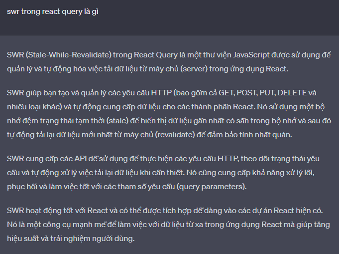

## Đây là Docs tự research:

- ❓ Đây là câu hỏi trong bài này:

- ❓ Câu hỏi: Anh ơi, em thấy trong `useQuery()` đã có sẵn hàm `refetch()`, em cũng hay dùng hàm này mỗi khi cần refetch data sau khi `mutate`. Vậy hàm `refetch()` này khác thế nào với 2 cái `queryClient.setQueyData()` và `queryClient.invalidateQueries()` là gì ấy anh ?

- ✅ Trả lời: `refetch` => Gọi 1 cái query instance trong component. `invalidateQueries` => Gọi lại 1 hoặc nhiều query, có thể dùng cho các component khác cũng được. `setQueryData` => Cập nhật data mới (không fetch lại API)

## Bạn có thể tìm hiểu thêm về cách sử dụng `invalidateQueries` và các tùy chọn khác `invalidateQueries`:

- Tất nhiên! Cùng tìm hiểu thêm về cách sử dụng `invalidateQueries` và các tùy chọn trong React Query.

- Phương thức `invalidateQueries` được sử dụng để làm mới các truy vấn trong React Query. Nó có thể được sử dụng với các tùy chọn để kiểm soát cách truy vấn được làm mới.

- Cú pháp:

```jsx
queryClient.invalidateQueries(key, options)
```

- Trong đó:

  - `key` là key hoặc một mảng các key của các truy vấn cần làm mới.
  - `options` là một đối tượng (object) tùy chọn (không bắt buộc) để kiểm soát hành vi làm mới.

- Các tùy chọn phổ biến khi sử dụng `invalidateQueries` bao gồm:

  1. `exact`: Mặc định là `false`. Khi được đặt thành `true`, chỉ có các truy vấn có key chính xác trùng khớp với key mới sẽ được làm mới, các truy vấn con hoặc truy vấn khác không được làm mới.

  2. `refetchActive`: Mặc định là `false`. Khi được đặt thành `true`, các truy vấn đang trong quá trình `fetching` sẽ được hủy và làm mới.

  3. `refetchInactive`: Mặc định là `false`. Khi được đặt thành `true`, các truy vấn không hoạt động (`inactive`) sẽ được làm mới. Một truy vấn được coi là không hoạt động nếu không có listeners nào đang lắng nghe sự thay đổi trong nó.

  4. `throwOnError`: Mặc định là `false`. Khi được đặt thành `true`, nếu có lỗi xảy ra trong quá trình làm mới truy vấn, nó sẽ ném ra lỗi để được xử lý bên ngoài.

- Ví dụ sử dụng `invalidateQueries` với các tùy chọn:

```jsx
import { useQueryClient } from 'react-query';

const TodoList = () => {
  const queryClient = useQueryClient();

  const handleDeleteTodo = async (todoId) => {
    // Gọi API để xóa todo
    await deleteTodoAPI(todoId);

    // Làm mới truy vấn 'todos' và chỉ làm mới truy vấn chính xác
    queryClient.invalidateQueries('todos', {
      exact: true
    });
  };

  return (
    // ...
  );
};
```

- Trong ví dụ trên, chúng ta sử dụng `invalidateQueries` để làm mới truy vấn `'todos'` và chỉ làm mới truy vấn có key chính xác là `'todos'`. Các truy vấn con hoặc truy vấn khác không được làm mới.

- Đây là một ví dụ cơ bản về cách sử dụng `invalidateQueries` và các tùy chọn trong React Query. Bạn có thể tìm hiểu thêm về các tùy chọn khác và các khả năng linh hoạt khác của React Query trong tài liệu chính thức của nó.

## Biết được cách sử dụng Invalidate Query (`invalidateQueries`) trong React Query:

- Trong React Query, `invalidateQueries` là một phương thức được cung cấp bởi `useQueryClient` để làm mới (invalidate) các truy vấn đã được lưu trong bộ nhớ cache. Khi chúng ta gọi phương thức này, React Query sẽ xóa kết quả truy vấn trong cache và kích hoạt lại việc truy vấn dữ liệu mới từ nguồn dữ liệu (ví dụ: từ API).

- Dưới đây là cách sử dụng phương thức `invalidateQueries` trong React Query:

1. Đầu tiên, chúng ta cần lấy instance của `queryClient` bằng cách sử dụng `useQueryClient` trong component:

```jsx
import { useQueryClient } from 'react-query'

const MyComponent = () => {
  const queryClient = useQueryClient()

  // ...
}
```

2. Sau đó, khi muốn làm mới một hoặc nhiều truy vấn, chúng ta gọi phương thức `invalidateQueries` trên `queryClient`:

```jsx
queryClient.invalidateQueries('todos')
```

- Trong ví dụ trên, chúng ta gọi `invalidateQueries('todos')` để làm mới các truy vấn có key là `'todos'`. Điều này sẽ xóa kết quả truy vấn trong cache và kích hoạt lại việc truy vấn dữ liệu mới cho các truy vấn có key là `'todos'`.

- Ngoài ra, chúng ta có thể truyền một mảng các key để làm mới nhiều truy vấn cùng một lúc:

```jsx
queryClient.invalidateQueries(['todos', 'user', 'posts'])
```

- Trong ví dụ trên, chúng ta làm mới các truy vấn có key là `'todos'`, `'user'` và `'posts'`. Tất cả các truy vấn này sẽ được xóa khỏi cache và truy vấn lại từ nguồn dữ liệu.

- `invalidateQueries` cũng hỗ trợ một số tùy chọn để điều chỉnh cách làm mới truy vấn, như `exact` để chỉ làm mới truy vấn chính xác bằng key hoặc `refetchActive` để làm mới các truy vấn đang được hoạt động. Để biết thêm chi tiết, bạn có thể tham khảo tài liệu chính thức của React Query.

## Hướng dẫn và ví dụ về việc sử dụng React Query, bao gồm cả việc sử dụng phương thức `invalidateQueries` ?

- Để sử dụng phương thức `invalidateQueries` trong React Query, bạn cần làm như sau:

1. Đầu tiên, đảm bảo rằng bạn đã cài đặt React Query và đã import các hàm cần thiết từ thư viện:

```jsx
import { useQueryClient } from 'react-query'
```

2. Trong component của bạn, sử dụng hook `useQueryClient` để lấy một instance của `QueryClient`:

```jsx
const queryClient = useQueryClient()
```

3. Bây giờ bạn có thể sử dụng phương thức `invalidateQueries` để làm mới các truy vấn trong `QueryClient`. Phương thức này nhận vào một key hoặc một mảng các key để chỉ định các truy vấn cần làm mới:

```jsx
queryClient.invalidateQueries('todos') // Làm mới truy vấn có key là 'todos'
queryClient.invalidateQueries(['user', userId]) // Làm mới truy vấn có key là ['user', userId]
queryClient.invalidateQueries() // Làm mới tất cả các truy vấn trong QueryClient
```

- Ví dụ về việc sử dụng `invalidateQueries`:

```jsx
import { useQuery, useQueryClient } from 'react-query'

const TodoList = () => {
  const queryClient = useQueryClient()

  const handleDeleteTodo = async (todoId) => {
    // Gọi API để xóa todo
    await deleteTodoAPI(todoId)

    // Làm mới truy vấn 'todos' sau khi xóa
    queryClient.invalidateQueries('todos')
  }

  return (
    <div>
      {/* Hiển thị danh sách todo */}
      {todos.map((todo) => (
        <div key={todo.id}>
          <span>{todo.title}</span>
          <button onClick={() => handleDeleteTodo(todo.id)}>Xóa</button>
        </div>
      ))}
    </div>
  )
}
```

- Trong ví dụ trên, khi người dùng nhấn vào nút "Xóa" để xóa một todo, chúng ta gọi API để thực hiện xóa todo đó. Sau khi xóa thành công, chúng ta sử dụng `invalidateQueries` để làm mới truy vấn 'todos', từ đó đảm bảo rằng danh sách todos được cập nhật mới nhất.

## Cập nhật data của query thông qua mutation trong React Query:

## Hiểu cách sử dụng tính năng prefetching của React Query:

## Cập nhật data query thông qua setQueryData trong React Query:

## refetch lại query thông qua cơ chế invalidate trong React Query:

## Sử dụng tính năng prefetching query trong React Query:

## Đây là Docs của Được Dev:

Ở video lần trước nếu anh em để ý thì mình có một bug nho nhỏ trong phần Student Info đó là không hiển thị đúng gender, video này mình sẽ fix luôn.

💓Kiến thức các bạn sẽ được học trong video này:

🎉 Biết được cách sử dụng Invalidate Query
🎉 Cập nhật data của query thông qua mutation
🎉 Hiểu cách sử dụng tính năng prefetching của React Query

🕰️Nội dung chính

00:00 - Cập nhật data query thông qua setQueryData
05:38 - refetch lại query thông qua cơ chế invalidate
12:14 - Sư dụng tính năng prefetching query


