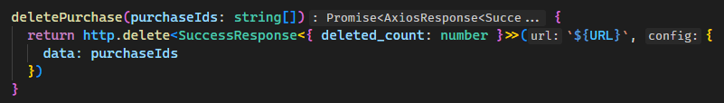
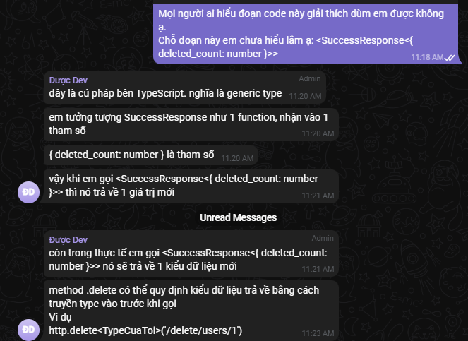

# Giải thích file code purchase.api.ts

- Đoạn code trên định nghĩa một module JavaScript/TypeScript liên quan đến các yêu cầu API liên quan đến mua hàng (purchase) và quản lý giỏ hàng. Hãy chia đoạn code ra từng phần và giải thích từng phần chi tiết:

```jsx
import { Purchase, PurchaseListStatus } from 'src/types/purchase.type'
import { SuccessResponse } from 'src/types/utils.type'
import http from 'src/utils/http'
```

1. Import các kiểu dữ liệu và module:

- Dòng đầu tiên import các kiểu dữ liệu `Purchase` và `PurchaseListStatus` từ module 'src/types/purchase.type'. Điều này giả định rằng có các định nghĩa kiểu tương ứng trong file 'purchase.type.ts' (hoặc 'purchase.type.tsx') trong thư mục 'src/types'.

- Dòng thứ hai import kiểu `SuccessResponse` từ module 'src/types/utils.type'. Điều này giả định rằng có một định nghĩa kiểu tên là `SuccessResponse` trong file 'utils.type.ts' (hoặc 'utils.type.tsx') trong thư mục 'src/types'.

- Dòng thứ ba import biến `http` từ module 'src/utils/http'. Điều này giả định rằng có một file hoặc module tên là `'http'` trong thư mục 'src/utils', chịu trách nhiệm thực hiện các yêu cầu HTTP.

---

```jsx
const URL = 'purchases'
```

- Định nghĩa các hằng số:

- Biến `URL` là một hằng số (constant) với giá trị là `'purchases'`. Biến này lưu trữ đường dẫn API để thực hiện các yêu cầu API liên quan đến mua hàng (purchase).

---

```jsx
const purchaseApi = {
  addToCart(body: { product_id: string; buy_count: number }) {
    return http.post<SuccessResponse<Purchase>>(`${URL}/add-to-cart`, body)
  },
  getPurchases(params: { status: PurchaseListStatus }) {
    return http.get<SuccessResponse<Purchase[]>>(`${URL}`, {
      params
    })
  },
  buyProducts(body: { product_id: string; buy_count: number }[]) {
    return http.post<SuccessResponse<Purchase[]>>(`${URL}/buy-products`, body)
  },
  updatePurchase(body: { product_id: string; buy_count: number }) {
    return http.put<SuccessResponse<Purchase>>(`${URL}/update-purchase`, body)
  },
  deletePurchase(purchaseIds: string[]) {
    return http.delete<SuccessResponse<{ deleted_count: number }>>(`${URL}`, {
      data: purchaseIds
    })
  }
}
```

- Đoạn code trên định nghĩa một đối tượng có tên `purchaseApi`, chứa năm phương thức tương ứng với các yêu cầu API liên quan đến mua hàng (purchase) và quản lý giỏ hàng.

1. Phương thức `addToCart(body: { product_id: string; buy_count: number }) { ... }`:

- Phương thức `addToCart()` nhận một tham số `body` là một đối tượng chứa hai thuộc tính: `product_id` và `buy_count`, cả hai đều có kiểu dữ liệu tương ứng là `string` và `number`. Đối tượng này đại diện cho thông tin sản phẩm được thêm vào giỏ hàng.

- Phương thức này gọi hàm `http.post<SuccessResponse<Purchase>>(${URL}/add-to-cart, body)` để thực hiện yêu cầu POST đến đường dẫn API được xác định bởi biến `URL` kết hợp với `'/add-to-cart'`, để thêm sản phẩm vào giỏ hàng.

- Kết quả trả về của hàm này là một Promise chứa dữ liệu có kiểu `SuccessResponse<Purchase>`, tức là phản hồi từ server sau khi hoàn tất yêu cầu thêm sản phẩm vào giỏ hàng.

2. Phương thức `getPurchases(params: { status: PurchaseListStatus }) { ... }`:

- Phương thức `getPurchases()` nhận một tham số `params` là một đối tượng chứa một thuộc tính `status` có kiểu dữ liệu là `PurchaseListStatus`. Đối tượng này được sử dụng để truy vấn danh sách các mua hàng (purchase) theo trạng thái (status).

- Phương thức này gọi hàm `http.get<SuccessResponse<Purchase[]>>(${URL}, { params })` để thực hiện yêu cầu GET đến đường dẫn API được xác định bởi biến `URL`, để lấy danh sách các mua hàng dựa trên thông tin truy vấn.

- Kết quả trả về của hàm này là một Promise chứa dữ liệu có kiểu `SuccessResponse<Purchase[]>`, tức là phản hồi từ server sau khi hoàn tất yêu cầu lấy danh sách các mua hàng.

3. Phương thức `buyProducts(body: { product_id: string; buy_count: number }[]) { ... }`:

- Phương thức `buyProducts()` nhận một tham số `body` là một mảng (array) các đối tượng, mỗi đối tượng (object) chứa hai thuộc tính `product_id` và `buy_count`, cả hai đều có kiểu dữ liệu tương ứng là `string` và `number`. Mảng này đại diện cho thông tin các sản phẩm muốn mua.

- Phương thức này gọi hàm `http.post<SuccessResponse<Purchase[]>>(${URL}/buy-products, body)` để thực hiện yêu cầu POST đến đường dẫn API được xác định bởi biến `URL` kết hợp với `'/buy-products'`, để mua các sản phẩm trong giỏ hàng.

- Kết quả trả về của hàm này là một Promise chứa dữ liệu có kiểu `SuccessResponse<Purchase[]>`, tức là phản hồi từ server sau khi hoàn tất yêu cầu mua các sản phẩm.

4. Phương thức `updatePurchase(body: { product_id: string; buy_count: number }) { ... }`:

- Phương thức `updatePurchase()` nhận một tham số `body` là một đối tượng chứa hai thuộc tính `product_id` và `buy_count`, cả hai đều có kiểu dữ liệu tương ứng là `string` và `number`. Đối tượng này đại diện cho thông tin sản phẩm cần cập nhật số lượng mua hàng.

- Phương thức này gọi hàm `http.put<SuccessResponse<Purchase>>(${URL}/update-purchase, body)` để thực hiện yêu cầu PUT đến đường dẫn API được xác định bởi biến `URL` kết hợp với `'/update-purchase'`, để cập nhật số lượng mua hàng của sản phẩm.

- Kết quả trả về của hàm này là một Promise chứa dữ liệu có kiểu `SuccessResponse<Purchase>`, tức là phản hồi từ server sau khi hoàn tất yêu cầu cập nhật số lượng mua hàng.

5. Phương thức `deletePurchase(purchaseIds: string[]) { ... }`:

- Phương thức `deletePurchase()` nhận một tham số `purchaseIds` là một mảng các chuỗi (string), đại diện cho danh sách các ID của mua hàng (purchase) cần xóa.

- Phương thức này gọi hàm `http.delete<SuccessResponse<{ deleted_count: number }>>(${URL}, { data: purchaseIds })` để thực hiện yêu cầu DELETE đến đường dẫn API được xác định bởi biến `URL`, và truyền danh sách các ID cần xóa qua tham số `data`.

- Kết quả trả về của hàm này là một Promise chứa dữ liệu có kiểu `SuccessResponse<{ deleted_count: number }>>`, tức là phản hồi từ server sau khi hoàn tất yêu cầu xóa các mua hàng.

---

## Trên đó là giải thích sơ lược, còn dưới đây là giải thích chi tiết từng đoạn code:

❌❌ Đoạn 1 ❌❌

```jsx
addToCart(body: { product_id: string; buy_count: number }) {
  return http.post<SuccessResponse<Purchase>>(`${URL}/add-to-cart`, body)
},
```

- Dòng code này định nghĩa một phương thức có tên `addToCart` trong đối tượng `purchaseApi`. Phương thức này dùng để thêm một sản phẩm vào giỏ hàng (cart) thông qua một yêu cầu HTTP POST đến một đường dẫn API cụ thể.

- Giải thích chi tiết:

- `addToCart(body: { product_id: string; buy_count: number }) { ... }`: Đây là cú pháp của phương thức `addToCart`. Phương thức này nhận một tham số có tên `body`, là một đối tượng chứa hai thuộc tính: `product_id` và `buy_count`.

  - `product_id` là một chuỗi (string) đại diện cho ID của sản phẩm muốn thêm vào giỏ hàng.
  - `buy_count` là một số (number) đại diện cho số lượng sản phẩm muốn mua.

- `return http.post<SuccessResponse<Purchase>>(${URL}/add-to-cart, body)`: Đoạn code này thực hiện yêu cầu POST đến đường dẫn API được xác định bởi biến `URL`, kết hợp với `'/add-to-cart'`, để thêm sản phẩm vào giỏ hàng.

  - `http.post` là một hàm xử lý yêu cầu HTTP POST, được giả định đã được định nghĩa và xuất ra từ module 'src/utils/http'.

  - `http.post` nhận hai đối số:

    - Đối số thứ nhất: Đây là chuỗi kết hợp của đường dẫn API và '/add-to-cart', tạo ra đường dẫn cụ thể cho yêu cầu thêm sản phẩm vào giỏ hàng.

    - Đối số thứ hai: Đây là đối tượng `body`, chứa thông tin của sản phẩm muốn thêm vào giỏ hàng (gồm `product_id` và `buy_count`).

  - `http.post` trả về một Promise chứa dữ liệu có kiểu `SuccessResponse<Purchase>`, tức là phản hồi từ server sau khi hoàn tất yêu cầu thêm sản phẩm vào giỏ hàng.

- Như vậy, khi gọi phương thức `addToCart` và truyền đối tượng `body` chứa thông tin của sản phẩm muốn thêm vào giỏ hàng, phương thức sẽ thực hiện yêu cầu POST đến đường dẫn cụ thể và server sẽ xử lý yêu cầu và trả về phản hồi có chứa thông tin sản phẩm đã được thêm vào giỏ hàng.

❌❌ Đoạn 2 ❌❌

```jsx
getPurchases(params: { status: PurchaseListStatus }) {
  return http.get<SuccessResponse<Purchase[]>>(`${URL}`, {
  params
  })
},
```

- Đoạn code trên định nghĩa một phương thức có tên `getPurchases` trong đối tượng `purchaseApi`. Phương thức này dùng để lấy danh sách các mua hàng (purchase) dựa vào trạng thái (status) thông qua một yêu cầu HTTP GET đến một đường dẫn API cụ thể.

- Giải thích chi tiết:

- `getPurchases(params: { status: PurchaseListStatus }) { ... }`: Đây là cú pháp của phương thức `getPurchases`. Phương thức này nhận một tham số có tên `params`, là một đối tượng chứa một thuộc tính `status` có kiểu dữ liệu là `PurchaseListStatus`.

  - `params` là một đối tượng đại diện cho các thông số truy vấn cần thiết để lấy danh sách các mua hàng theo trạng thái.

- `return http.get<SuccessResponse<Purchase[]>>(${URL}, { params })`: Đoạn code này thực hiện yêu cầu GET đến đường dẫn API được xác định bởi biến `URL` để lấy danh sách các mua hàng dựa trên thông tin truy vấn.

  - `http.get` là một hàm xử lý yêu cầu HTTP GET, được giả định đã được định nghĩa và xuất ra từ module 'src/utils/http'.

  - `http.get` nhận hai đối số:

    - Đối số thứ nhất: Đây là chuỗi kết hợp của đường dẫn API, tạo ra đường dẫn cụ thể cho yêu cầu lấy danh sách các mua hàng.

    - Đối số thứ hai: Đây là đối tượng `params`, chứa thông tin của trạng thái mua hàng (status) dùng để truy vấn danh sách mua hàng.

  - Bằng cách truyền thông tin truy vấn qua đối số `params`, server có thể xử lý yêu cầu và trả về danh sách các mua hàng thỏa mãn điều kiện trạng thái.

  - `http.get` trả về một Promise chứa dữ liệu có kiểu `SuccessResponse<Purchase[]>`, tức là phản hồi từ server sau khi hoàn tất yêu cầu lấy danh sách các mua hàng.

- Như vậy, khi gọi phương thức `getPurchases` và truyền đối tượng `params` chứa trạng thái mua hàng cần lấy, phương thức sẽ thực hiện yêu cầu GET đến đường dẫn cụ thể và server sẽ xử lý yêu cầu và trả về phản hồi chứa danh sách các mua hàng thỏa mãn điều kiện trạng thái.

## ❓ Trong đoạn code đó có `SuccessResponse<Purchase[]>`. Hãy giải thích dấu `[]` trong đoạn code đó có ý nghĩa là gì ?

- Trong đoạn code `SuccessResponse<Purchase[]>`, dấu `[]` đặt sau kiểu dữ liệu `Purchase` có ý nghĩa là `Purchase[]` là một mảng (array) chứa các phần tử có kiểu dữ liệu là `Purchase`.

- Cụ thể, ta có các khái niệm sau:

- `Purchase`: Đây là một kiểu dữ liệu (type) đại diện cho thông tin một mua hàng (purchase). Định nghĩa của kiểu dữ liệu này chứa các thuộc tính cần thiết để mô tả mua hàng, ví dụ: `product_id`, `buy_count`, `purchase_date`, v.v.

- `Purchase[]`: Đây là một kiểu dữ liệu mảng (array) chứa các phần tử có kiểu `Purchase`. Nó đại diện cho danh sách các mua hàng, mỗi phần tử trong mảng là một mua hàng có cấu trúc tương tự như kiểu `Purchase`.

- `SuccessResponse<T>`: Đây là một kiểu dữ liệu dùng để đóng gói dữ liệu phản hồi từ server sau khi thực hiện yêu cầu API thành công. Trong trường hợp này, `T` được chỉ định là `Purchase[]`, nghĩa là phản hồi từ server sẽ chứa dữ liệu là một mảng các mua hàng (`Purchase[]`) sau khi hoàn tất yêu cầu thành công.

- Ví dụ: Nếu ta có một phản hồi từ server là một danh sách các mua hàng, kiểu dữ liệu của phản hồi sẽ là `SuccessResponse<Purchase[]>`. Khi ta truy cập vào phần dữ liệu chứa danh sách mua hàng, ta sẽ nhận được một mảng các đối tượng có kiểu `Purchase` (tương ứng với thông tin mỗi mua hàng).

❌❌ Đoạn 3 ❌❌

```jsx
buyProducts(body: { product_id: string; buy_count: number }[]) {
  return http.post<SuccessResponse<Purchase[]>>(`${URL}/buy-products`, body)
},
```

- Đoạn code trên định nghĩa một phương thức có tên `buyProducts` trong đối tượng `purchaseApi`. Phương thức này dùng để mua các sản phẩm trong giỏ hàng thông qua một yêu cầu HTTP POST đến một đường dẫn API cụ thể.

- Giải thích chi tiết:

- `buyProducts(body: { product_id: string; buy_count: number }[]) { ... }`: Đây là cú pháp của phương thức `buyProducts`. Phương thức này nhận một tham số có tên `body`, là một mảng (array) các đối tượng, mỗi đối tượng chứa hai thuộc tính `product_id` và `buy_count`.

  - `product_id` là một chuỗi (string) đại diện cho ID của sản phẩm muốn mua.
  - `buy_count` là một số (number) đại diện cho số lượng sản phẩm muốn mua.

- `return http.post<SuccessResponse<Purchase[]>>(${URL}/buy-products, body)`: Đoạn code này thực hiện yêu cầu POST đến đường dẫn API được xác định bởi biến `URL`, kết hợp với `'/buy-products'`, để mua các sản phẩm trong giỏ hàng.

  - `http.post` là một hàm xử lý yêu cầu HTTP POST, được giả định đã được định nghĩa và xuất ra từ module 'src/utils/http'.

  - `http.post` nhận hai đối số:

    - Đối số thứ nhất: Đây là chuỗi kết hợp của đường dẫn API và `'/buy-products'`, tạo ra đường dẫn cụ thể cho yêu cầu mua các sản phẩm.

    - Đối số thứ hai: Đây là mảng `body`, chứa thông tin của các sản phẩm muốn mua (gồm `product_id` và `buy_count`).

  - Bằng cách truyền thông tin mua hàng qua đối số `body`, server có thể xử lý yêu cầu và thực hiện mua các sản phẩm được yêu cầu.

  - `http.post` trả về một Promise chứa dữ liệu có kiểu `SuccessResponse<Purchase[]>`, tức là phản hồi từ server sau khi hoàn tất yêu cầu mua các sản phẩm.

- Như vậy, khi gọi phương thức `buyProducts` và truyền một mảng chứa thông tin của các sản phẩm muốn mua, phương thức sẽ thực hiện yêu cầu POST đến đường dẫn cụ thể và server sẽ xử lý yêu cầu mua các sản phẩm và trả về phản hồi chứa thông tin các mua hàng sau khi hoàn tất.

❌❌ Đoạn 4 ❌❌

```jsx
updatePurchase(body: { product_id: string; buy_count: number }) {
  return http.put<SuccessResponse<Purchase>>(`${URL}/update-purchase`, body)
},
```

- Đoạn code trên định nghĩa một phương thức có tên `updatePurchase` trong đối tượng `purchaseApi`. Phương thức này dùng để cập nhật số lượng mua hàng của một sản phẩm thông qua một yêu cầu HTTP PUT đến một đường dẫn API cụ thể.

- Giải thích chi tiết:

- `updatePurchase(body: { product_id: string; buy_count: number }) { ... }`: Đây là cú pháp của phương thức `updatePurchase`. Phương thức này nhận một tham số có tên `body`, là một đối tượng chứa hai thuộc tính `product_id` và `buy_count`.

  - `product_id` là một chuỗi (string) đại diện cho ID của sản phẩm muốn cập nhật số lượng mua hàng.

  - `buy_count` là một số (number) đại diện cho số lượng mua hàng mới cần cập nhật cho sản phẩm.

- `return http.put<SuccessResponse<Purchase>>(${URL}/update-purchase, body)`: Đoạn code này thực hiện yêu cầu PUT đến đường dẫn API được xác định bởi biến `URL`, kết hợp với `'/update-purchase'`, để cập nhật số lượng mua hàng của sản phẩm.

  - `http.put` là một hàm xử lý yêu cầu HTTP PUT, được giả định đã được định nghĩa và xuất ra từ module 'src/utils/http'.

  - `http.put` nhận hai đối số:

    - Đối số thứ nhất: Đây là chuỗi kết hợp của đường dẫn API và `'/update-purchase'`, tạo ra đường dẫn cụ thể cho yêu cầu cập nhật số lượng mua hàng.

    - Đối số thứ hai: Đây là đối tượng `body`, chứa thông tin của sản phẩm muốn cập nhật số lượng mua hàng (gồm `product_id` và `buy_count`).

  - Bằng cách truyền thông tin cập nhật qua đối số `body`, `server` có thể xử lý yêu cầu và cập nhật số lượng mua hàng của sản phẩm.

  - `http.put` trả về một Promise chứa dữ liệu có kiểu `SuccessResponse<Purchase>`, tức là phản hồi từ server sau khi hoàn tất yêu cầu cập nhật số lượng mua hàng.

- Như vậy, khi gọi phương thức `updatePurchase` và truyền đối tượng `body` chứa thông tin sản phẩm muốn cập nhật số lượng mua hàng, phương thức sẽ thực hiện yêu cầu PUT đến đường dẫn cụ thể và server sẽ xử lý yêu cầu và trả về phản hồi chứa thông tin mua hàng sau khi cập nhật thành công.

❌❌ Đoạn 5 ❌❌

```jsx
deletePurchase(purchaseIds: string[]) {
  return http.delete<SuccessResponse<{ deleted_count: number }>>(`${URL}`, {
    data: purchaseIds
  })
}
```

- Đoạn code trên định nghĩa một phương thức có tên `deletePurchase` trong đối tượng `purchaseApi`. Phương thức này dùng để xóa các mua hàng (purchase) thông qua một yêu cầu HTTP DELETE đến một đường dẫn API cụ thể.

- Giải thích chi tiết:

- `deletePurchase(purchaseIds: string[]) { ... }`: Đây là cú pháp của phương thức `deletePurchase`. Phương thức này nhận một tham số có tên `purchaseIds`, là một mảng (array) chứa các chuỗi (string), đại diện cho danh sách các ID của các mua hàng muốn xóa.

- `return http.delete<SuccessResponse<{ deleted_count: number }>>(${URL}, { data: purchaseIds })`: Đoạn code này thực hiện yêu cầu DELETE đến đường dẫn API được xác định bởi biến `URL` để xóa các mua hàng.

  - `http.delete` là một hàm xử lý yêu cầu HTTP DELETE, được giả định đã được định nghĩa và xuất ra từ module 'src/utils/http'.

  - `http.delete` nhận hai đối số:

    - Đối số thứ nhất: Đây là chuỗi kết hợp của đường dẫn API, tạo ra đường dẫn cụ thể cho yêu cầu xóa các mua hàng.

    - Đối số thứ hai: Đây là đối tượng chứa thông tin gửi kèm yêu cầu, trong trường hợp này, thông tin xóa được truyền qua thuộc tính `data`. Đối tượng này chứa mảng `purchaseIds` với dữ liệu là danh sách các ID của các mua hàng muốn xóa.

  - Bằng cách truyền danh sách các ID mua hàng cần xóa qua đối số `data`, server có thể xử lý yêu cầu và thực hiện xóa các mua hàng tương ứng.

  - `http.delete` trả về một Promise chứa dữ liệu có kiểu `SuccessResponse<{ deleted_count: number }>`, tức là phản hồi từ server sau khi hoàn tất yêu cầu xóa các mua hàng.

- Như vậy, khi gọi phương thức `deletePurchase` và truyền một mảng chứa danh sách các ID mua hàng cần xóa, phương thức sẽ thực hiện yêu cầu DELETE đến đường dẫn cụ thể và server sẽ xử lý yêu cầu và trả về phản hồi chứa thông tin số lượng các mua hàng đã bị xóa thành công.

## ❓ Hãy giải thích dòng code này:

```jsx
SuccessResponse<{ deleted_count: number }>
```

- Dòng `SuccessResponse<{ deleted_count: number }>` đại diện cho một kiểu dữ liệu (type) trong TypeScript.

- `SuccessResponse`: Đây là tên của kiểu dữ liệu, có thể là một kiểu dữ liệu tự định nghĩa trong ứng dụng hoặc import từ một file khác. Trong trường hợp này, kiểu dữ liệu `SuccessResponse` có thể là một kiểu dữ liệu đại diện cho phản hồi từ server sau khi hoàn tất một yêu cầu API thành công.

- `<{ deleted_count: number }>`: Đây là phần thể hiện cụ thể cho kiểu dữ liệu `SuccessResponse`. Trong trường hợp này, kiểu dữ liệu `SuccessResponse` chứa một đối tượng có một thuộc tính `deleted_count` với kiểu dữ liệu là `number`.

- Cụ thể, nếu ta có một phản hồi từ server thành công, nó có thể trả về một đối tượng có cấu trúc như sau:

```jsx
const response: SuccessResponse<{ deleted_count: number }> = {
  success: true,
  message: 'Delete operation successful',
  data: {
    deleted_count: 3
  }
}
```

- Trong ví dụ trên, `response` là một đối tượng kiểu `SuccessResponse`, trong đó `deleted_count` là một thuộc tính của đối tượng có kiểu dữ liệu `number`, thể hiện số lượng các mua hàng đã bị xóa sau khi hoàn tất yêu cầu xóa thành công.

- Vì `SuccessResponse` có thể là một kiểu dữ liệu tự định nghĩa hoặc import từ một file khác, bạn cần kiểm tra định nghĩa của nó trong ứng dụng hoặc module để hiểu rõ hơn về các thuộc tính và kiểu dữ liệu chính xác của nó.

---

## 🚀🚀 Đây là cách giải thích của anh Được Dev trong group chat:

- Đây là câu hỏi:



- Đây là đoạn code mà mình hỏi và anh Được đã giải thích ở hình dưới:



---

```jsx
export default purchaseApi
```

- Xuất module `purchaseApi`:

- Dòng code này xuất module `purchaseApi` để có thể sử dụng các phương thức trong đó từ các module khác bằng cách import.

---
