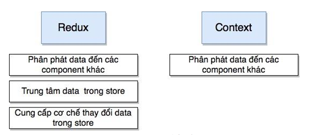

# Giải thích chi tiết code trong file app.context.tsx

- Đoạn code trên là một phần của việc tạo và quản lý React `Context` trong ứng dụng. React `Context` là một công cụ cho phép bạn chia sẻ dữ liệu giữa các component trong cây component mà không cần truyền dữ liệu qua các props. `Context` thường được sử dụng để chia sẻ dữ liệu có tính toàn cục (global), chẳng hạn như trạng thái ứng dụng hoặc dữ liệu liên quan đến người dùng đã đăng nhập.

- Đoạn mã này sử dụng trong môi trường của React, nó tạo một React `Context` để lưu trữ và chia sẻ dữ liệu giữa các thành phần con trong ứng dụng.

- Giải thích từng phần chi tiết:

```jsx
import { createContext, useState } from 'react'
import { ExtendedPurchase } from 'src/types/purchase.type'
import { User } from 'src/types/user.type'
import { getAccessTokenFromLS, getProfileFromLS } from 'src/utils/auth'
```

- Đầu tiên, các module và hàm (function) cần thiết được import:

- `createContext`: Hàm này giúp tạo một React Context mới. `createContext` là một hàm được sử dụng để tạo một context. Context là một cách để chia sẻ dữ liệu và trạng thái giữa các component của React.
- `useState`: Hook của React dùng để tạo state và cập nhật state của functional component. `useState` là một hook được sử dụng để quản lý trạng thái trong React. Hook là một cách để thêm chức năng vào component của React mà không cần viết class.
- `ExtendedPurchase`: Kiểu dữ liệu (type) được import từ đường dẫn 'src/types/purchase.type'. Đây có thể là một kiểu dữ liệu được định nghĩa cho đối tượng mua hàng mở rộng (chứa nhiều thông tin hơn so với đối tượng mua hàng cơ bản).
- `User`: Kiểu dữ liệu được import từ đường dẫn 'src/types/user.type'. Đây có thể là một kiểu dữ liệu được định nghĩa cho đối tượng người dùng.

---

```jsx
interface AppContextInterface {
  isAuthenticated: boolean
  setIsAuthenticated: React.Dispatch<React.SetStateAction<boolean>>
  profile: User | null
  setProfile: React.Dispatch<React.SetStateAction<User | null>>
  extendedPurchases: ExtendedPurchase[]
  setExtendedPurchases: React.Dispatch<React.SetStateAction<ExtendedPurchase[]>>
  reset: () => void
}
```

- Trong đoạn code trên, định nghĩa một interface TypeScript có tên là `AppContextInterface`. Interface này định nghĩa các kiểu dữ liệu và phương thức cần thiết cho việc quản lý trạng thái ứng dụng thông qua React Context.

- Giải thích từng phần chi tiết của `AppContextInterface`:

1. `isAuthenticated: boolean`:

- Đây là một thuộc tính có kiểu dữ liệu là `boolean`.

- Thuộc tính này đại diện cho trạng thái xác định người dùng đã đăng nhập hay chưa.

- Giá trị của `isAuthenticated` sẽ là `true` nếu người dùng đã đăng nhập và `false` nếu người dùng chưa đăng nhập.

2. `setIsAuthenticated: React.Dispatch<React.SetStateAction<boolean>>`:

- Đây là một thuộc tính có kiểu dữ liệu là `React.Dispatch<React.SetStateAction<boolean>>`.

- Thuộc tính này đại diện cho phương thức để cập nhật giá trị của `isAuthenticated`.

- `React.Dispatch` là một kiểu dữ liệu được cung cấp bởi thư viện React, dùng để thay đổi giá trị của biến trạng thái (`useState`) trong Functional Component.

- `React.SetStateAction<boolean>` là kiểu dữ liệu đại diện cho hành động thay đổi giá trị của `isAuthenticated`, có kiểu là `boolean`.

3. `profile: User | null`:

- Đây là một thuộc tính có kiểu dữ liệu là `User | null`.

- `User` là một kiểu dữ liệu đã được định nghĩa trong ứng dụng.

- Thuộc tính này đại diện cho đối tượng người dùng chứa thông tin hồ sơ người dùng, hoặc có giá trị `null` nếu người dùng chưa đăng nhập.

4. `setProfile: React.Dispatch<React.SetStateAction<User | null>>`:

- Đây là một thuộc tính có kiểu dữ liệu là `React.Dispatch<React.SetStateAction<User | null>>`.

- Thuộc tính này đại diện cho phương thức để cập nhật giá trị của `profile`.

- `React.SetStateAction<User | null>` là kiểu dữ liệu đại diện cho hành động thay đổi giá trị của `profile`, có kiểu là `User | null`.

5. `extendedPurchases: ExtendedPurchase[]`:

- Đây là một thuộc tính có kiểu dữ liệu là một mảng các đối tượng `ExtendedPurchase`.

- `ExtendedPurchase` là một kiểu dữ liệu đã được định nghĩa trong ứng dụng.

- Thuộc tính này đại diện cho mảng chứa thông tin về các giao dịch mở rộng.

6. `setExtendedPurchases: React.Dispatch<React.SetStateAction<ExtendedPurchase[]>>`:

- Đây là một thuộc tính có kiểu dữ liệu là `React.Dispatch<React.SetStateAction<ExtendedPurchase[]>>`.

- Thuộc tính này đại diện cho phương thức để cập nhật giá trị của `extendedPurchases`.

- `React.SetStateAction<ExtendedPurchase[]>` là kiểu dữ liệu đại diện cho hành động thay đổi giá trị của `extendedPurchases`, có kiểu là một mảng các đối tượng `ExtendedPurchase`.

7. `reset: () => void`:

- Đây là một phương thức không có tham số và không có giá trị trả về (`void`).

- Phương thức này đại diện cho hành động reset (thiết lập lại) các giá trị trong Context về giá trị ban đầu.

---

```jsx
export const getInitialAppContext: () => AppContextInterface = () => ({
  isAuthenticated: Boolean(getAccessTokenFromLS()),
  setIsAuthenticated: () => null,
  profile: getProfileFromLS(),
  setProfile: () => null,
  extendedPurchases: [],
  setExtendedPurchases: () => null,
  reset: () => null
})
```

- Đoạn code trên định nghĩa hàm `getInitialAppContext`, có mục đích tạo và trả về giá trị ban đầu cho Context (`AppContextInterface`). Hàm này được gọi khi cần cung cấp giá trị mặc định cho Context khi chưa có giá trị cụ thể được cung cấp bởi Provider.

- Giải thích từng phần của `getInitialAppContext`:

1. `isAuthenticated: Boolean(getAccessTokenFromLS())`:

- Kiểm tra xem người dùng đã đăng nhập hay chưa bằng cách gọi hàm `getAccessTokenFromLS()`.

- Hàm `getAccessTokenFromLS()` được sử dụng để lấy token truy cập của người dùng từ Local Storage.

- Hàm `Boolean()` được sử dụng để chuyển đổi giá trị lấy từ `getAccessTokenFromLS()` thành kiểu boolean (true/false).

- `isAuthenticated` sẽ có giá trị là `true` nếu người dùng đã đăng nhập và `false` nếu chưa đăng nhập.

2. `setIsAuthenticated: () => null`:

- `setIsAuthenticated` là một hàm để cập nhật giá trị của `isAuthenticated`, nhưng trong đoạn code này, nó được định nghĩa là một hàm không làm gì cả (trả về `null`).

- Điều này có nghĩa là hàm `setIsAuthenticated` sẽ được ghi đè trong Provider khi được sử dụng.

3. `profile: getProfileFromLS()`:

- Lấy thông tin hồ sơ người dùng từ Local Storage bằng cách gọi hàm `getProfileFromLS()`.

- Nếu người dùng đã đăng nhập và có thông tin hồ sơ, `profile` sẽ chứa thông tin này.

- Nếu người dùng chưa đăng nhập hoặc không có thông tin hồ sơ, `profile` sẽ có giá trị `null`.

4. `setProfile: () => null`:

- `setProfile` là một hàm để cập nhật giá trị của `profile`, nhưng trong đoạn code này, nó được định nghĩa là một hàm không làm gì cả (trả về `null`).

- Điều này có nghĩa là hàm `setProfile` sẽ được ghi đè trong Provider khi được sử dụng.

5. `extendedPurchases: []`:

- `extendedPurchases` là một mảng chứa thông tin về các giao dịch mở rộng (`ExtendedPurchase`).

- Trong trường hợp này, mảng được thiết lập là một mảng rỗng, tức là không có giao dịch mở rộng nào ban đầu.

6. `setExtendedPurchases: () => null`:

- `setExtendedPurchases` là một hàm để cập nhật giá trị của `extendedPurchases`, nhưng trong đoạn code này, nó được định nghĩa là một hàm không làm gì cả (trả về `null`).

- Điều này có nghĩa là hàm `setExtendedPurchases` sẽ được ghi đè trong Provider khi được sử dụng.

7. `reset: () => null`:

- `reset` là một hàm không có tham số và không có giá trị trả về (`void`).

- Hàm này được sử dụng để reset (thiết lập lại) các giá trị trong Context về giá trị ban đầu.

- Trong đoạn code này, hàm `reset` được định nghĩa là một hàm không làm gì cả (trả về `null`), tức là không có hành động reset nào được thực hiện ban đầu.

---

```jsx
const initialAppContext = getInitialAppContext()
```

- Dòng code trên gọi hàm `getInitialAppContext()` để lấy giá trị ban đầu cho Context (`AppContextInterface`) và gán nó vào biến `initialAppContext`.

- Hàm `getInitialAppContext()` được gọi để tạo và trả về giá trị ban đầu cho Context.

- Kết quả trả về từ hàm `getInitialAppContext()` sẽ là một đối tượng có kiểu dữ liệu là `AppContextInterface`.

- Giá trị này chứa thông tin về trạng thái ban đầu của ứng dụng, bao gồm trạng thái đăng nhập (`isAuthenticated`), thông tin hồ sơ người dùng (`profile`), mảng giao dịch mở rộng (`extendedPurchases`), và phương thức reset (`reset`) được cung cấp qua Context.

- Sau khi hàm `getInitialAppContext()` được gọi và trả về giá trị, biến `initialAppContext` sẽ chứa các giá trị trạng thái ban đầu và sẽ được sử dụng khi tạo Provider trong Context.

---

```jsx
export const AppContext = createContext < AppContextInterface > initialAppContext
```

- Đoạn code trên định nghĩa một React Context có tên là `AppContext` sử dụng hàm `createContext`. Context này được sử dụng để chia sẻ và cung cấp các giá trị trạng thái và phương thức từ Provider xuống các component con trong cây DOM của ứng dụng.

- Giải thích từng phần chi tiết của đoạn code:

1. `createContext<AppContextInterface>(initialAppContext)`:

- Hàm `createContext` được sử dụng để tạo một Context mới.

- Trong trường hợp này, chúng ta tạo một Context có tên là `AppContext`.

- Dấu ngoặc `<...>` sau `createContext` chứa kiểu dữ liệu của Context, ở đây là `AppContextInterface`.

- `initialAppContext` là giá trị mặc định của Context. Nếu không có Provider cung cấp giá trị cụ thể cho Context, giá trị mặc định này sẽ được sử dụng.

2. `export const AppContext = ...`:

- Đoạn code trên xuất ra Context `AppContext` để có thể sử dụng ở bất kỳ đâu trong ứng dụng.

- Bằng cách xuất Context này ra, các component con có thể sử dụng Hook `useContext` để truy cập và sử dụng giá trị trạng thái và phương thức từ Context.

- Như vậy, thông qua Context `AppContext`, các component con trong cây DOM có thể truy cập và sử dụng các giá trị trạng thái và phương thức được định nghĩa trong `AppContextInterface` mà không cần truyền dữ liệu qua props. Điều này giúp giảm bớt sự phức tạp của việc quản lý dữ liệu và tiết kiệm thời gian và công sức trong việc truyền dữ liệu giữa các component.

---

```jsx
export const AppProvider = ({
  children,
  defaultValue = initialAppContext
}: {
  children: React.ReactNode
  defaultValue?: AppContextInterface
}) => {
  const [isAuthenticated, setIsAuthenticated] = useState<boolean>(defaultValue.isAuthenticated)
  const [extendedPurchases, setExtendedPurchases] = useState<ExtendedPurchase[]>(defaultValue.extendedPurchases)
  const [profile, setProfile] = useState<User | null>(defaultValue.profile)

  const reset = () => {
    setIsAuthenticated(false)
    setExtendedPurchases([])
    setProfile(null)
  }
}
```

1. `export const AppProvider = (...) => { ... }`:

- Đoạn code trên định nghĩa một Functional Component có tên `AppProvider`.

- `AppProvider` là một Provider React dùng để cung cấp và quản lý trạng thái và phương thức thông qua Context (`AppContext`) xuống cho các component con trong cây DOM.

2. `{ children, defaultValue = initialAppContext }: { ... }`:

- Đoạn code này định nghĩa tham số của `AppProvider`.

- `children`: Tham số này chứa các component con được bao bọc bên trong `AppProvider`. Các component con này sẽ có thể truy cập vào dữ liệu và phương thức từ Context.

- `defaultValue`: Tham số này chứa giá trị mặc định của Context. Nếu không có Provider cung cấp giá trị cụ thể cho Context, giá trị mặc định này sẽ được sử dụng.

---

❌❌Phân tích đoạn code đó ra cho dễ hiểu❌❌

```bash
({
  children,
  defaultValue = initialAppContext
}: {
  children: React.ReactNode
  defaultValue?: AppContextInterface
})
```

- Đoạn code trên định nghĩa một tham số cho Functional Component `AppProvider`. Tham số này được gọi là object destructuring (cấu trúc đối tượng), cho phép ta truy cập các thuộc tính của object được truyền vào.

- Giải thích từng phần chi tiết của đoạn code:

1. `({ children, defaultValue = initialAppContext }: { ... })`:

- Đây là một tham số của Functional Component `AppProvider` được định nghĩa dưới dạng object destructuring.

- Tham số này là một object có hai thuộc tính:

  - `children`: Đại diện cho các component con được bao bọc bên trong `AppProvider`. Đây là một thuộc tính bắt buộc (required) và phải được cung cấp khi sử dụng `AppProvider`.

  - `defaultValue`: Đại diện cho giá trị mặc định của Context (`AppContext`). Đây là một thuộc tính tùy chọn (optional), và nếu không được cung cấp, giá trị mặc định của Context sẽ là `initialAppContext`.

2. `{ ... }`:

- Dấu ngoặc nhọn `{ ... }` trong tham số `({ ... })` cho phép truy cập các thuộc tính của object được truyền vào và gán chúng vào các biến ứng với tên thuộc tính tương ứng.

- Trong đoạn code trên, `children` và `defaultValue` là các biến được gán giá trị từ thuộc tính tương ứng của object được truyền vào khi sử dụng `AppProvider`.

3. `children: React.ReactNode`:

- `children` là biến đại diện cho các component con được bao bọc bên trong `AppProvider`.

- `React.ReactNode` là kiểu dữ liệu cho các children của Functional Component trong React. Nó đại diện cho bất kỳ loại nội dung nào có thể xuất hiện trong React, bao gồm các component, văn bản, các phần tử HTML, ...

- Vì `children` là một thuộc tính bắt buộc, nó phải có kiểu dữ liệu `React.ReactNode`.

4. `defaultValue?: AppContextInterface`:

- `defaultValue` là biến đại diện cho giá trị mặc định của Context (`AppContext`).

- `AppContextInterface` là kiểu dữ liệu của Context (`AppContext`) đã được định nghĩa bởi interface `AppContextInterface`.

- `defaultValue` là một thuộc tính tùy chọn, vì có dấu hỏi `?` sau tên thuộc tính, cho phép không cần cung cấp giá trị mặc định khi sử dụng `AppProvider`.

- Nếu không có giá trị cụ thể được cung cấp khi sử dụng `AppProvider`, giá trị mặc định sẽ là `initialAppContext`.

❌❌Xong phần giải thích❌❌

---

3. `const [isAuthenticated, setIsAuthenticated] = useState<boolean>(defaultValue.isAuthenticated)`:

- Dùng `useState` để tạo một biến trạng thái `isAuthenticated` và một hàm `setIsAuthenticated` để cập nhật giá trị của biến trạng thái này.

- Giá trị ban đầu của `isAuthenticated` sẽ được lấy từ `defaultValue.isAuthenticated`, tức là giá trị `isAuthenticated` trong `initialAppContext`.

4. `const [extendedPurchases, setExtendedPurchases] = useState<ExtendedPurchase[]>(defaultValue.extendedPurchases)`:

- Dùng `useState` để tạo một biến trạng thái `extendedPurchases` và một hàm `setExtendedPurchases` để cập nhật giá trị của biến trạng thái này.

- Giá trị ban đầu của `extendedPurchases` sẽ được lấy từ `defaultValue.extendedPurchases`, tức là giá trị `extendedPurchases` trong `initialAppContext`.

5. `const [profile, setProfile] = useState<User | null>(defaultValue.profile)`:

- Dùng `useState` để tạo một biến trạng thái `profile` và một hàm `setProfile` để cập nhật giá trị của biến trạng thái này.

- Giá trị ban đầu của `profile` sẽ được lấy từ `defaultValue.profile`, tức là giá trị `profile` trong `initialAppContext`.

6. `const reset = () => { ... }`:

- Định nghĩa hàm `reset` để thiết lập lại các giá trị trạng thái của Provider về giá trị ban đầu.

- Trong hàm `reset`, giá trị của `isAuthenticated` sẽ được đặt về `false`, `extendedPurchases` sẽ là một mảng rỗng `[]`, và `profile` sẽ được đặt về `null`.

- Khi hàm `reset` được gọi, các giá trị trạng thái của Provider sẽ được reset về giá trị ban đầu của `defaultValue` trong `initialAppContext`.

- Sau khi tạo các biến trạng thái và hàm `reset`, `AppProvider` sẽ cung cấp các giá trị và hàm này xuống cho các component con thông qua Context (`AppContext.Provider`). Các component con có thể sử dụng Hook `useContext` để truy cập và sử dụng các giá trị và hàm này trong ứng dụng.

---

```jsx
return (
  <AppContext.Provider
    value={{
      isAuthenticated,
      setIsAuthenticated,
      profile,
      setProfile,
      extendedPurchases,
      setExtendedPurchases,
      reset
    }}
  >
    {children}
  </AppContext.Provider>
)
```

- Đoạn code trên là phần trả về của `AppProvider`, nơi mà giá trị và hàm trạng thái được cung cấp thông qua Context (`AppContext`) xuống cho các component con.

- Giải thích từng phần chi tiết của đoạn code:

1. `<AppContext.Provider ...>`:

- Đoạn code trên sử dụng Context Provider (`AppContext.Provider`) để cung cấp các giá trị trạng thái và phương thức cho các component con trong cây DOM.

- Giá trị và hàm trạng thái được cung cấp thông qua thuộc tính `value` của Provider.

2. `value={{ ... }}`:

- Đoạn code này định nghĩa đối tượng (object) chứa các giá trị trạng thái (state) và phương thức (method) được cung cấp xuống cho các component con thông qua Context.

- Các thuộc tính của đối tượng tương ứng với tên của giá trị và hàm trạng thái đã được định nghĩa trước đó trong `AppProvider`.

3. `isAuthenticated, setIsAuthenticated, profile, setProfile, extendedPurchases, setExtendedPurchases, reset`:

- Các biến và hàm trạng thái đã được tạo trong `AppProvider` được cung cấp thông qua đối tượng `value`.

- Như vậy, các component con sẽ có thể truy cập và sử dụng giá trị của `isAuthenticated`, `profile`, `extendedPurchases` và các hàm `setIsAuthenticated`, `setProfile`, `setExtendedPurchases`, `reset` thông qua Context.

4. `{children}`:

- Giữa các thẻ `AppContext.Provider`, chúng ta có `{children}`. Điều này cho phép các component con được bao bọc bên trong Provider.

- Các component con bên trong `AppProvider` sẽ có thể truy cập vào các giá trị và hàm trạng thái từ Context thông qua Hook `useContext`.

- Tóm lại, đoạn code trên cung cấp các giá trị và hàm trạng thái từ `AppProvider` xuống cho các component con thông qua Context (`AppContext`). Điều này cho phép các component con trong cây DOM có thể truy cập và sử dụng các giá trị và hàm trạng thái này mà không cần truyền dữ liệu qua props. Việc sử dụng Context giúp giảm bớt sự phức tạp của việc quản lý dữ liệu và tiết kiệm thời gian và công sức trong việc truyền dữ liệu giữa các component.

---

❌❌Ôn lại khái niệm Context, trong Context gồm có những gì❌❌

## Hãy nêu khái niệm React Context API ?

## Trong Context gồm có những gì ?

## Cho ví dụ cơ bản về Context API trong React ?

## Cho ví dụ nâng cao về Context API trong React ?

## Tạo Context trong react ?

## Cách update data trong Context ?

## So sánh Redux và Context ?


