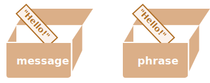

# Tham trị và tham chiếu

JS về bản chất thì có 2 kiểu dữ liệu chính là tham trị và tham chiếu

## Kiểu tham trị (primitive types)

Có những kiểu dưới đây:

1. number
2. string
3. boolean
4. null
5. undefined
6. BigInt
7. Symbol

### Việc copy biến với tham trị

```js
let message = 'Hello!'
let phrase = message
```

Chúng ta có 2 biến độc lập, **mỗi biến đều chứa giá trị là `"Hello"`**



Quá dễ hiểu!

## Kiểu tham chiếu (reference types)

1. object
2. array
3. function

Thực ra array & function về bản chất vẫn là object cả thôi.

### Việc copy biến với tham chiếu

Object thì không giống như các kiểu dữ liệu của tham trị.

**Một biến object không lưu trữ giá trị, nó lưu trữ "địa chỉ bộ nhớ" - hay còn gọi là nó tham chiếu đến ô nhớ**

`user` là biến object

```js
let user = {
  name: 'John'
}
```


Object thì được lưu trữ đâu đó trong bộ nhớ (bên phải hình), còn biến `user` thì tham chiếu đến nó.

**Khi chúng ta copy một biến object, tham chiếu của nó sẽ bị copy, object không bị nhân đôi lên**

```js
let user = { name: 'John' }

let admin = user // copy the reference
```

Bây giờ chúng ta có 2 biến đều tham chiếu đến cùng một object


Chúng ta có thể sử dụng biến để truy cập đến object và chỉnh sửa chúng

```js
let user = { name: 'John' }

let admin = user

admin.name = 'Pete' // changed by the "admin" reference

console.log(user.name) // 'Pete', changes are seen from the "user" reference
```

### So sánh với tham chiếu

2 object chỉ bằng nhau khi nó cùng một object

Ví dụ `a` và `b` cùng tham chiếu đến một object nên nó bằng nhau

```js
let a = {}
let b = a // copy the reference

console.log(a == b) // true, both variables reference the same object
console.log(a === b) // true
```

Và dưới đây là 2 object độc lập, dù cho chúng nhìn có vẻ giống nhau thì chúng cũng không bằng nhau

```js
let a = {}
let b = {}

console.log(a == b) // false
console.log(a === b) // false
```

### Clone và merge

Copy một biến object sẽ tạo thêm 1 biến khác tham chiếu đến cùng object đó

Nhưng trong nhiều trường hợp chúng ta cần nhân đôi một object để khi chỉnh sửa biến này thì không ảnh hưởng đến biến kia. Chúng ta gọi cái này là **clone**

Clone thường có 2 loại là

- clone thường (cũng có thể gọi là shallow copy)
- deep clone (cũng có thể gọi là deep copy)

Với clone thường thì người ta thường dùng **spread syntax** để clone `clone = {...user}`

```js
let user = {
  name: 'John',
  age: 30
}

// Bây giờ clone là một object độc lập với cùng nội dung với user
let clone = { ...user }
clone.name = 'Peter'
console.log(user.name) // Vẫn là John trong object gốc
```

Hoặc sài vòng lặp

```js
let user = {
  name: 'John',
  age: 30
}

let clone = {} // một object rỗng

// Cùng copy các thuộc tính nào
for (let key in user) {
  clone[key] = user[key]
}
clone.name = 'Pete'
console.log(user.name) // Vẫn là John trong object gốc
```

Clone thường chỉ hiệu quả với những object 1 cấp, những object nested nhiều cấp thì phải deep clone

### Deep clone

Những ví dụ với biến object `user` trên thì các thuộc tính bên trong đều là tham trị. Nhưng các thuộc tính cũng có thể tham chiếu đến một object khác.

Như thế này:

```js
let user = {
  name: 'John',
  sizes: {
    height: 182,
    width: 50
  }
}

console.log(user.sizes.height) // 182
```

Bây giờ clone với cách thông thường không thể copy nổi `user.sizes` bởi vì nó là một object, nếu copy thì nó sẽ bị tham chiếu và `clone.sizes` và `user.sizes` sẽ cùng tham chiếu đến một địa chỉ ô nhớ (một object)

```js
let user = {
  name: 'John',
  sizes: {
    height: 182,
    width: 50
  }
}

let clone = { ...user }

console.log(user.sizes === clone.sizes) // true, Vì cùng object

// user và clone chia sẻ sizes
user.sizes.width++ // Thay đổi thuộc tính từ một nơi
console.log(clone.sizes.width) // 51, Tại nơi khác kết quả cũng bị thay đổi theo
```

Để fix vấn đề này thì chúng ta có thể dùng một số phương pháp dưới đây

- `JSON.parse(JSON.stringify())`
- Dùng method [\_.cloneDeep(obj)](https://lodash.com/docs#cloneDeep) của thư viện Lodash (sâu bên trong nó dùng đệ quy để lặp các thuộc tính bên trong object)
- Dùng các thư viện như [immer](https://immerjs.github.io/immer/). Thư viện này khá hiệu quả vì đôi lúc chúng ta cũng không cần thiết clone hết cả một object lớn để chỉnh sửa 1 vài thuộc tính, cơ chế của cái này là chỉnh sửa thuộc tính nào thì nó sẽ tự tính và clone cho đúng thôi. Vậy nên giúp cải thiện về mặt performance trong một số trường hợp.

#### Lưu ý: Const object cũng có thể chỉnh sửa

Giá trị của user là không thay đổi, nhưng object bên trong nó thì tự do, muốn làm gì cũng đc.

```js
const user = {
  name: 'John'
}

user.name = 'Pete' // (*)

console.log(user.name) // Pete
```

Nó chỉ lỗi khi chúng ta set `user=...` thôi.
