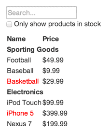
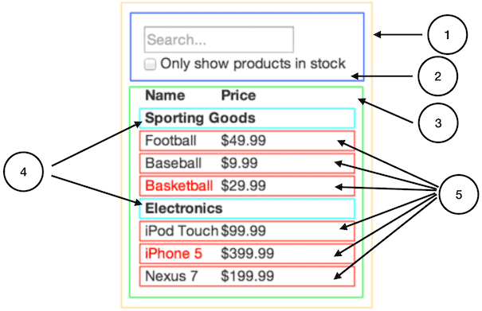

# Thinking in React - Cách suy nghĩ trong React

React có thể xây dựng các web app từ nhỏ cho đến lớn. Điều quan trọng là cách chúng ta suy nghĩ thiết kế làm sao cho web app chúng ta có thể mở rộng dễ dàng.

Phần tuyệt vời nhất của React chính là cách bạn suy nghĩ về việc build app như thế nào

## Bắt đầu với mock

Tưởng tượng rằng chúng ta có một JSON API và một design từ designer như dưới đây



JSON API trả về data như dưới đây

```json
[
  {category: "Sporting Goods", price: "$49.99", stocked: true, name: "Football"},
  {category: "Sporting Goods", price: "$9.99", stocked: true, name: "Baseball"},
  {category: "Sporting Goods", price: "$29.99", stocked: false, name: "Basketball"},
  {category: "Electronics", price: "$99.99", stocked: true, name: "iPod Touch"},
  {category: "Electronics", price: "$399.99", stocked: false, name: "iPhone 5"},
  {category: "Electronics", price: "$199.99", stocked: true, name: "Nexus 7"}
];
```

### Bước 1: Phân tích UI thành các component nhỏ

- Nhìn vào design và tự phân tích thành những component nhỏ
- Ý tưởng để chia component là component đó chỉ nên làm một thứ thôi!
- Nếu component đó lớn dần lên, chúng ta nên chia nó thành các component nhỏ hơn
- Chúng ta thường hiển thị JSON data model lên cho user xem, vậy nên bạn cần phải quan sát kỹ coi thử UI đã khớp với JSON model chưa.
- UI và data model thường sẽ có xu hướng là cùng một "cấu trúc thông tin", vậy nên bạn có thể chia UI thành những component khớp với một phần của data model.



Như hình trên bạn sẽ thấy chúng ta có 5 component trong app.

**1. FilterableProductTable (orange):** Chứa toàn bộ ví dụ chúng ta
**2. SearchBar (blue):** Khu vực user nhập liệu
**3. ProductTable (green):** Hiển thị và filter danh sách dựa trên user nhập
**4. ProductCategoryRow (turquoise):** Hiển thị tiêu đề cho mỗi category
**5. ProductRow (red):** Hiển thị mỗi sản phẩm

Chúng ta đã xác định được các component rồi, bây giờ hãy sắp xếp chúng thành từng level cha con với nhau.

- FilterableProductTable

  - SearchBar
  - ProductTable

    - ProductCategoryRow
    - ProductRow

### Bước 2: Xây dựng một UI tĩnh trong React

- Bây giờ bạn hãy tiến hành code một templete tĩnh, sử dụng `prop` để truyền vào các component và render ra dữ liệu.
- Chúng ta không cần dùng state vì bây giờ chúng ta cần một version tĩnh, nên state là không cần thiết
- Chúng ta chỉ cần truyền một mock data vào prop để render dữ liệu
- Bạn có thể code từ trên xuống hoặc từ dưới lên, sao cũng được

## Bước 3: Xác định từng thành phần nhỏ như state và event trong các component

Để UI chúng ta có thể tương tác được, chúng ta cần phải có state cũng như các event để xử lý.

Ví dụ trên, chúng ta hãy nghĩ về những thành phần nhỏ của data như:

- list products ban đầu
- search text mà user nhập
- value của checkbox
- list products được filter ra sẽ như thế nào

Bây giờ chúng ta hãy xem và phân tích cái nào cần dùng state. Bạn có thể tự trả lời 3 câu hỏi này

1. Nó có thể được truyền từ component cha xuống thông qua prop hay không? Nếu có, chúng ta không nên dùng state cho nó
2. Nó có cố định theo thời gian hay không? Nếu có, state có thể không phải là lựa chọn hay
3. Bạn có thể tính toán nó dựa vào bất cứ giá trị state hoặc prop nào đó trong component của bạn hay không? Nếu có, chúng ta cũng không cần dùng state

Vậy chúng ta có thể tính như sau

- **list products** ban đầu không có data, sau khi gọi API thì mới có => **list products** nên là state

- **search text** và **checkbox** có thể thay đổi theo thời gian mỗi khi người dùng nhập hoặc thay đổi => **search text** và **checkbox** nên là state

- **list products được filter** có thể tính dựa vào list products ban đầu và giá trị search text / checkbox => **list products được filter** không nên là state

## Bước 4: Xác định state bạn nên đặt ở đâu

Ok, bây giờ chúng ta cần xác định component nào nên nắm giữ state

> Nhớ rằng React chỉ có 1 luồng duy nhất là truyền data trừ trên xuống dưới. Sẽ không có chuyện component con truyền data ngược lên cho component cha.

Dưới đây là một số mẹo để bạn xác định nên đặt state ở đâu

- Tìm những component mà data của chúng có sự tương tác lẫn nhau => Chúng ta nên đặt state ở component cha chung của các component con này. **Mình đã nói rất kỹ vấn đề này ở bài lifting state up - đưa state lên trên**
- Tìm component cha chung: Component cha chung thường là nơi đặt state để truyền xuống các component con
- Nếu bạn không tìm thấy component nào phù hợp để đặt state => Tạo một component cha mới để bọc các component con và đặt state ở component cha đó.

Bây giờ hãy cùng nhìn qua app chúng ta:

- `ProductTable` cần hiển thị danh sách sản phẩm dựa trên giá trị **product list** state, `SearchBar` cần hiển thị **search text** và **checked** state.
- Nhận thấy `ProductTable` cần 2 giá trị là **search text** và **checked** của `SearchBar` để có thể filter cái danh sách product => Vậy nên chúng ta nên đặt **search text** và **checked** state ở component cha là `FilterableProductTable` để tiện truyền xuống `ProductTable` dùng.
- Còn về **product list** state chúng ta có 2 tuỳ chọn là đặt ở

  - `ProductTable`: Nếu đặt **product list** state ở đây thì `ProductTable` sẽ mất đi một phần tính tái sử dụng, vì `ProductTable` luôn render ra một danh sách cố định.

    - Và nhớ ở bài **lifting state up** mình có nói nếu 1 component có thể dùng state hoặc props thì trong nhiều trường hợp nên chọn prop.

  - `FilterableProductTable`: Đặt state ở đây thì chúng ta sẽ truyền state xuống `ProductTable` thông qua prop, `ProductTable` sẽ có tính tái sử dụng cao. Nếu cần dùng `ProductTable` ở 1 nơi nào đó thì chỉ cần thay đổi props chúng ta sẽ có 1 danh sách product mới.
    - Chưa hết, để **product list** state ở đây cùng với những state như **search text** và **checked** state sẽ làm flow data của chúng ta đi 1 hướng thống nhất

## Bước 5: Hoàn thiện Data flow

Bây giờ chúng ta đã có được hết state và prop để phục vụ việc render dữ liệu rồi. Bạn nhận ra rằng **search text** và **checked** state được đặt ở `FilterableProductTable` và event handler lại ở `SearchBar`. Bạn cần thay đổi state của một component cha ở một component con? Như đã được học thì chúng ta không thể thay đổi state của component cha ngay tại component con 1 cách trực tiếp như `setState()` được, mà cần phải gián tiếp thông qua prop.

Những lúc này chúng ta có thể sử dụng callback. Chúng ta sẽ truyền một callback xuống `SearchBar`, khi người dùng thao tác thì sẽ gọi callback này, callback này sẽ gọi đến `setState()` ở `FilterableProductTable`
